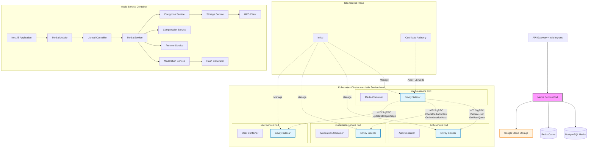
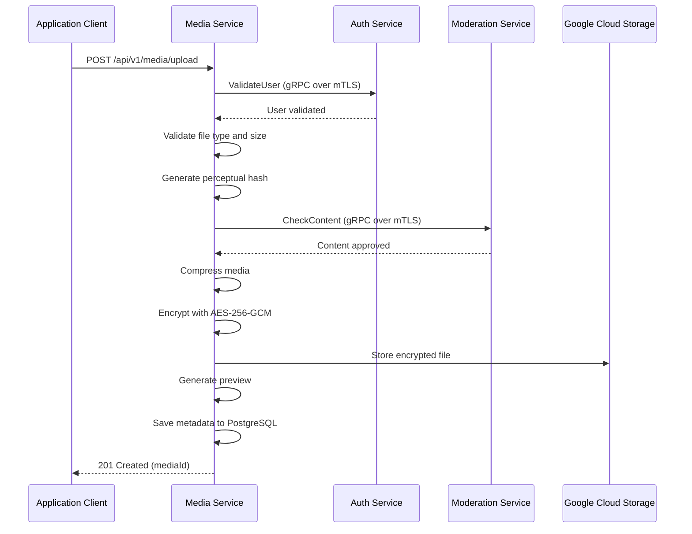
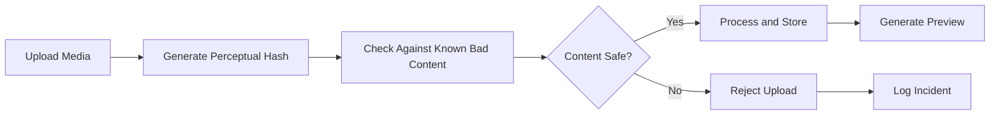
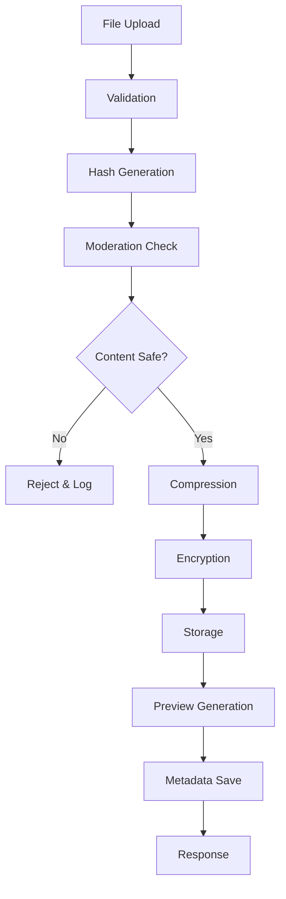
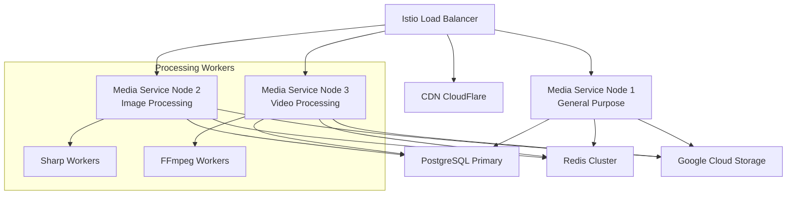

# Media Service (`media-service`) - System Design Document

## 0. Sommaire

- [1. Introduction](#1-introduction)
  - [1.1 Objectif du Document](#11-objectif-du-document)
  - [1.2 Périmètre du Service](#12-périmètre-du-service)
  - [1.3 Relations avec les Autres Services](#13-relations-avec-les-autres-services)
- [2. Architecture Globale](#2-architecture-globale)
  - [2.1 Vue d'Ensemble de l'Architecture avec Istio Service Mesh](#21-vue-densemble-de-larchitecture-avec-istio-service-mesh)
  - [2.2 Principes Architecturaux](#22-principes-architecturaux)
- [3. Choix Technologiques](#3-choix-technologiques)
  - [3.1 Stack Technique](#31-stack-technique)
  - [3.2 Infrastructure](#32-infrastructure)
- [4. Composants Principaux](#4-composants-principaux)
  - [4.1 Structure Express.js/TypeScript](#41-structure-expressjs-typescript)
  - [4.2 Gestionnaire de Médias](#42-gestionnaire-de-médias)
  - [4.3 Moteur de Chiffrement](#43-moteur-de-chiffrement)
  - [4.4 Système de Modération](#44-système-de-modération)
  - [4.5 Gestionnaire de Stockage](#45-gestionnaire-de-stockage)
  - [4.6 Communication avec les autres services via Istio Service Mesh](#46-communication-avec-les-autres-services-via-istio-service-mesh)
    - [4.6.1 Configuration Istio pour media-service](#461-configuration-istio-pour-media-service)
  - [4.7 Configuration et Modules](#47-configuration-et-modules)
- [5. Gestion des Médias](#5-gestion-des-médias)
  - [5.1 Types de Médias Supportés](#51-types-de-médias-supportés)
  - [5.2 Pipeline de Traitement](#52-pipeline-de-traitement)
  - [5.3 Compression et Optimisation](#53-compression-et-optimisation)
  - [5.4 Génération de Previews](#54-génération-de-previews)
- [6. Sécurité et Chiffrement](#6-sécurité-et-chiffrement)
  - [6.1 Chiffrement bout-en-bout](#61-chiffrement-bout-en-bout)
  - [6.2 Hash de Modération](#62-hash-de-modération)
  - [6.3 Validation des Fichiers](#63-validation-des-fichiers)
- [7. Scaling et Performances](#7-scaling-et-performances)
  - [7.1 Stratégie de Scaling](#71-stratégie-de-scaling)
  - [7.2 Cache et Optimisations](#72-cache-et-optimisations)
  - [7.3 Limites et Quotas avec Istio](#73-limites-et-quotas-avec-istio)
- [8. Monitoring et Observabilité](#8-monitoring-et-observabilité)
  - [8.1 Observabilité Istio](#81-observabilité-istio)
  - [8.2 Logging](#82-logging)
  - [8.3 Métriques](#83-métriques)
  - [8.4 Alerting](#84-alerting)
- [9. Gestion des Erreurs et Résilience](#9-gestion-des-erreurs-et-résilience)
  - [9.1 Stratégie de Gestion des Erreurs](#91-stratégie-de-gestion-des-erreurs)
  - [9.2 Résilience avec Istio](#92-résilience-avec-istio)
  - [9.3 Plan de Reprise d'Activité](#93-plan-de-reprise-dactivité)
- [10. Évolution et Maintenance](#10-évolution-et-maintenance)
  - [10.1 Versionnement](#101-versionnement)
  - [10.2 Mise à Jour et Déploiement](#102-mise-à-jour-et-déploiement)
  - [10.3 Documentation Technique](#103-documentation-technique)
- [11. Considérations Opérationnelles](#11-considérations-opérationnelles)
  - [11.1 DevOps](#111-devops)
  - [11.2 Environnements](#112-environnements)
  - [11.3 Support](#113-support)
- [Appendices](#appendices)
  - [A. Métriques de Performance Cibles](#a-métriques-de-performance-cibles)
  - [B. Estimation des Ressources](#b-estimation-des-ressources)
  - [C. Configuration Istio Examples](#c-configuration-istio-examples)
  - [D. Références](#d-références)

## 1. Introduction

### 1.1 Objectif du Document
Ce document décrit l'architecture et la conception technique du service de gestion des médias (`media-service`) de l'application Whispr. Il sert de référence pour l'équipe de développement et les parties prenantes du projet.

### 1.2 Périmètre du Service
Le Media Service est responsable de la gestion complète des fichiers multimédias : upload, stockage sécurisé, chiffrement bout-en-bout, compression, génération de previews, et modération du contenu. Il maintient un système de quotas par utilisateur et coordonne avec les autres services pour la sécurité et la modération du contenu.

### 1.3 Relations avec les Autres Services
Le Media Service interagit avec plusieurs autres microservices de l'écosystème Whispr via Istio Service Mesh :
- **auth-service** : pour l'authentification et la validation des utilisateurs
- **user-service** : pour les informations de profil et les quotas utilisateur
- **messaging-service** : pour l'intégration des médias dans les conversations
- **moderation-service** : pour la validation et modération du contenu multimédia
- **notification-service** : pour les alertes liées aux médias

## 2. Architecture Globale

### 2.1 Vue d'Ensemble de l'Architecture avec Istio Service Mesh

Le service de gestion des médias fonctionne dans un service mesh Istio qui sécurise automatiquement toutes les communications inter-services :



### 2.2 Principes Architecturaux

- **Sécurité by design** : Chiffrement bout-en-bout de tous les médias avant stockage
- **Zero Trust Network** : Toutes les communications inter-services chiffrées et authentifiées via mTLS
- **Service Mesh Security** : Sécurité implémentée au niveau infrastructure via Istio
- **Modération préventive** : Analyse systématique du contenu avant stockage
- **Performance optimisée** : Compression intelligente et génération de previews
- **Quotas et limites** : Gestion stricte des ressources par utilisateur
- **Scaling horizontal** : Architecture stateless pour faciliter la montée en charge
- **Observabilité** : Logging structuré, métriques détaillées et tracing distribué via Istio

## 3. Choix Technologiques

### 3.1 Stack Technique

- **Langage** : TypeScript
- **Runtime** : Node.js
- **Framework** : NestJS
- **Service Mesh** : Istio pour la sécurité et l'observabilité des communications inter-services
- **Proxy Sidecar** : Envoy (injecté automatiquement par Istio)
- **Sécurité Inter-Services** : mTLS automatique via Istio avec rotation de certificats
- **Base de données** : PostgreSQL avec métadonnées des médias
- **Cache** : Redis pour les métadonnées et quotas utilisateur
- **Stockage** : Google Cloud Storage pour les fichiers chiffrés
- **Communication inter-services** : gRPC over mTLS automatique via Istio Service Mesh
- **ORM** : Prisma pour l'accès aux données
- **API** : REST avec décorateurs NestJS et documentation Swagger automatique
- **Chiffrement** : Node.js crypto pour le chiffrement AES-256-GCM
- **Traitement d'images** : Sharp pour la compression et les previews
- **Validation** : Joi pour la validation des inputs
- **Testing** : Jest avec modules de test NestJS pour tests unitaires et d'intégration

### 3.2 Infrastructure

- **Containerisation** : Docker
- **Orchestration** : Kubernetes (GKE)
- **Service Mesh** : Istio avec injection automatique de sidecars Envoy
- **Security** : mTLS automatique, AuthorizationPolicies et NetworkPolicies Istio
- **CI/CD** : GitHub Actions
- **Service Cloud** : Google Cloud Platform (GCP)
- **Stockage Fichiers** : Google Cloud Storage avec chiffrement côté client
- **Monitoring** : Prometheus + Grafana + Kiali (Istio service topology)
- **Logging** : Loki + accès logs Envoy
- **Tracing** : Jaeger (intégré avec Istio pour le tracing distribué)
- **Certificate Management** : Istio CA pour la rotation automatique des certificats mTLS
- **Secrets Management** : Google Secret Manager pour les clés de chiffrement

## 4. Composants Principaux

### 4.1 Structure NestJS/TypeScript

L'architecture NestJS du service est organisée comme suit :

```
src/
├── app.module.ts                    # Module racine de l'application
├── main.ts                         # Point d'entrée Bootstrap NestJS
├── config/                         # Configuration
│   ├── database.config.ts          # Configuration PostgreSQL
│   ├── storage.config.ts           # Configuration Google Cloud Storage
│   ├── encryption.config.ts        # Configuration des clés de chiffrement
│   └── redis.config.ts             # Configuration Redis
├── modules/                        # Modules NestJS
│   ├── media/                      # Module de gestion des médias
│   │   ├── media.module.ts         # Module principal
│   │   ├── controllers/
│   │   │   ├── upload.controller.ts      # Upload de médias
│   │   │   ├── download.controller.ts    # Téléchargement de médias
│   │   │   ├── preview.controller.ts     # Génération de previews
│   │   │   └── quota.controller.ts       # Gestion des quotas
│   │   ├── services/
│   │   │   ├── media.service.ts          # Service principal des médias
│   │   │   ├── encryption.service.ts     # Service de chiffrement
│   │   │   ├── storage.service.ts        # Service de stockage GCS
│   │   │   ├── compression.service.ts    # Service de compression
│   │   │   ├── preview.service.ts        # Service de génération de previews
│   │   │   └── moderation.service.ts     # Service de modération
│   │   ├── entities/
│   │   │   ├── media.entity.ts           # Entité Media (Prisma)
│   │   │   ├── quota.entity.ts           # Entité Quota
│   │   │   └── preview.entity.ts         # Entité Preview
│   │   └── dto/
│   │       ├── upload-media.dto.ts       # DTO pour upload
│   │       ├── media-response.dto.ts     # DTO pour réponses
│   │       └── quota.dto.ts              # DTO pour quotas
│   ├── grpc/                       # Module gRPC
│   │   ├── grpc.module.ts          # Module gRPC
│   │   └── clients/
│   │       ├── auth.client.ts            # Client vers auth-service
│   │       ├── user.client.ts            # Client vers user-service
│   │       └── moderation.client.ts      # Client vers moderation-service
│   ├── auth/                       # Module d'authentification
│   │   ├── auth.module.ts          # Module auth local
│   │   ├── guards/
│   │   │   ├── jwt-auth.guard.ts         # Guard JWT
│   │   │   └── roles.guard.ts            # Guard pour les rôles
│   │   └── decorators/
│   │       ├── current-user.decorator.ts # Décorateur utilisateur courant
│   │       └── public.decorator.ts       # Décorateur pour routes publiques
│   └── common/                     # Module commun
│       ├── common.module.ts        # Module utilitaires communs
│       ├── filters/
│       │   ├── http-exception.filter.ts  # Filtre d'exceptions
│       │   └── validation.filter.ts      # Filtre de validation
│       ├── interceptors/
│       │   ├── logging.interceptor.ts    # Intercepteur de logs
│       │   ├── transform.interceptor.ts  # Transformation réponses
│       │   └── timeout.interceptor.ts    # Gestion des timeouts
│       ├── pipes/
│       │   ├── validation.pipe.ts        # Pipe de validation
│       │   └── file-validation.pipe.ts   # Validation des fichiers
│       └── utils/
│           ├── hash.util.ts              # Génération de hash pour modération
│           ├── file.util.ts              # Utilitaires fichiers
│           └── metrics.util.ts           # Métriques custom
```

### 4.2 Gestionnaire de Médias

Le gestionnaire central coordonne toutes les opérations sur les médias :



### 4.3 Moteur de Chiffrement

Le système de chiffrement garantit la confidentialité des médias :

- **Algorithme** : AES-256-GCM pour le chiffrement authentifié
- **Gestion des clés** : Clés dérivées par utilisateur via PBKDF2
- **Intégrité** : Tag d'authentification pour vérifier l'intégrité
- **Performance** : Chiffrement en streaming pour les gros fichiers
- **Rotation** : Support de la rotation des clés de chiffrement

### 4.4 Système de Modération

L'intégration avec le service de modération assure la sécurité du contenu :



### 4.5 Gestionnaire de Stockage

Le gestionnaire de stockage coordonne avec Google Cloud Storage :

- **Buckets séparés** : Organisation par type de média et environnement
- **Lifecycle policies** : Suppression automatique des fichiers temporaires
- **Redundancy** : Stockage multi-régional pour la haute disponibilité
- **Accès sécurisé** : Signed URLs pour l'accès temporaire
- **Monitoring** : Surveillance de l'utilisation et des coûts

### 4.6 Communication avec les autres services via Istio Service Mesh

**Interfaces gRPC consommées** :
- **auth-service** :
  - `ValidateToken`: validation des tokens d'authentification
  - `GetUserInfo`: informations utilisateur pour la gestion des quotas
- **moderation-service** :
  - `CheckMediaContent`: validation du contenu multimédia
  - `GetContentHash`: récupération de hash pour déduplication
- **user-service** :
  - `UpdateStorageUsage`: mise à jour de l'utilisation du stockage
  - `GetUserQuotas`: récupération des limites utilisateur

**Interfaces REST exposées** :
- **Upload** : POST /api/v1/media/upload (multipart) avec @UseInterceptors(FileInterceptor)
- **Download** : GET /api/v1/media/{mediaId} avec @UseGuards(JwtAuthGuard)
- **Preview** : GET /api/v1/media/{mediaId}/preview avec cache headers
- **Delete** : DELETE /api/v1/media/{mediaId} avec @UseGuards(RolesGuard)
- **Hash Check** : POST /api/v1/media/hash-check avec @UsePipes(ValidationPipe)
- **Storage Stats** : GET /api/v1/media/storage avec décorateur @CurrentUser()

#### 4.6.1 Configuration Istio pour media-service

```yaml
# AuthorizationPolicy pour media-service vers moderation-service
apiVersion: security.istio.io/v1beta1
kind: AuthorizationPolicy
metadata:
  name: media-to-moderation
  namespace: whispr
spec:
  selector:
    matchLabels:
      app: moderation-service
  rules:
  - from:
    - source:
        principals: ["cluster.local/ns/whispr/sa/media-service"]
  - to:
    - operation:
        methods: ["POST"]
        paths: ["/moderation.ModerationService/CheckMediaContent"]

---
# AuthorizationPolicy pour clients vers media-service
apiVersion: security.istio.io/v1beta1
kind: AuthorizationPolicy
metadata:
  name: clients-to-media
  namespace: whispr
spec:
  selector:
    matchLabels:
      app: media-service
  rules:
  - from:
    - source:
        principals: ["cluster.local/ns/whispr/sa/api-gateway"]
  - to:
    - operation:
        methods: ["GET", "POST", "DELETE"]
        paths: ["/api/v1/media/*"]
```

### 4.7 Modules et Injection de Dépendances

- **MediaModule** : module principal avec controllers et services des médias
- **GrpcModule** : module pour les clients gRPC vers autres microservices via Istio mTLS
- **AuthModule** : module d'authentification avec guards et décorateurs
- **CommonModule** : module partagé avec utilitaires, filters et interceptors
- **ConfigModule** : gestion centralisée de la configuration avec validation
- **DatabaseModule** : intégration PostgreSQL avec Prisma ORM
- **HealthModule** : health checks pour Kubernetes et Istio via Terminus

## 5. Gestion des Médias

### 5.1 Types de Médias Supportés

| Type | Extensions | Taille Max | Compression | Preview |
|------|------------|------------|-------------|---------|
| Images | JPEG, PNG, WebP, HEIC | 25 MB | Oui | Oui |
| Vidéos | MP4, MOV, AVI | 100 MB | Oui | Thumbnail |
| Audio | MP3, WAV, AAC, OGG | 50 MB | Oui | Waveform |
| Documents | PDF, DOC, DOCX, TXT | 25 MB | Non | Thumbnail |
| Archives | ZIP, RAR | 50 MB | Non | Non |

### 5.2 Pipeline de Traitement



### 5.3 Compression et Optimisation

- **Images** : Compression JPEG avec qualité adaptive (70-95%)
- **Vidéos** : Réencodage H.264 avec résolution adaptative
- **Audio** : Compression MP3 à 128kbps pour les fichiers > 10MB
- **Algorithmes** : Sharp pour images, FFmpeg pour vidéo/audio
- **Préservation qualité** : Algorithmes lossless pour documents importants

### 5.4 Génération de Previews

- **Images** : Thumbnails en 3 tailles (64x64, 256x256, 512x512)
- **Vidéos** : Frame à 1 seconde + métadonnées (durée, résolution)
- **Audio** : Waveform visuelle + métadonnées (durée, format)
- **Documents** : Première page en thumbnail
- **Format** : WebP pour optimiser la bande passante

## 6. Sécurité et Chiffrement

### 6.1 Chiffrement bout-en-bout

- **Algorithme** : AES-256-GCM avec authentification intégrée
- **Clés** : Dérivation PBKDF2 avec salt unique par utilisateur
- **IV/Nonce** : Généré aléatoirement pour chaque fichier
- **Intégrité** : Tag d'authentification GCM vérifié au déchiffrement
- **Performance** : Streaming pour les fichiers > 10MB

### 6.2 Hash de Modération

- **Hash perceptuel** : Pour détecter les contenus similaires
- **Algorithme** : pHash pour images, hash MD5 pour autres types
- **Base de référence** : Coordination avec moderation-service
- **Déduplication** : Éviter le stockage de contenus identiques
- **Vérification** : Hash recalculé après compression

### 6.3 Validation des Fichiers

- **Magic bytes** : Vérification du type réel du fichier
- **Taille** : Limites strictes par type de média
- **Malware** : Scan antivirus via des APIs externes
- **Metadata** : Extraction et validation des métadonnées EXIF
- **Structure** : Validation de l'intégrité structurelle des fichiers

## 7. Scaling et Performances

### 7.1 Stratégie de Scaling

- **Horizontal Pod Autoscaling** : Scaling basé sur CPU/mémoire et upload rate
- **Istio Load Balancing** : Distribution intelligente avec session affinity
- **Circuit Breakers** : Protection contre les services externes défaillants
- **Instances spécialisées** : Pods dédiés pour le traitement vidéo lourd
- **CDN Integration** : Distribution via CloudFlare pour les previews



### 7.2 Cache et Optimisations

- **Metadata Cache** : Redis pour les informations fréquemment accédées
- **Preview Cache** : Cache des thumbnails avec TTL de 24h
- **Quota Cache** : Cache des limites utilisateur (TTL: 1h)
- **Connection Pooling** : Pools vers PostgreSQL et GCS
- **Streaming** : Upload/download en streaming pour les gros fichiers
- **Compression HTTP** : Gzip pour les métadonnées JSON

### 7.3 Limites et Quotas avec Istio

| Métrique | Limite | Contrôle |
|----------|--------|----------|
| Uploads par utilisateur/jour | 100 fichiers | Rate limiting Istio |
| Taille totale par utilisateur | 1 GB | Application level |
| Taille fichier unique | 100 MB | Validation |
| Requêtes par minute | 60 | Rate limiting Istio |
| Bande passante upload | 10 MB/s | Application level |
| Concurrent uploads | 3 par utilisateur | Semaphore |

## 8. Monitoring et Observabilité

### 8.1 Observabilité Istio

- **Kiali** : Visualisation des flux de données entre services
- **Jaeger** : Tracing distribué pour les opérations de media
- **Prometheus** : Métriques automatiques Istio + métriques custom
- **Grafana** : Dashboards pour performance et usage
- **Envoy Access Logs** : Logs détaillés des uploads/downloads

### 8.2 Logging

- **NestJS Logger** : Logger intégré avec niveaux configurables
- **Logging Interceptor** : Interception automatique des requêtes/réponses
- **Structured Logging** : JSON avec correlation IDs et request context
- **Upload Events** : Traçabilité complète des opérations avec @LogExecutionTime()
- **Error Context** : Exception filters enrichis avec contexte utilisateur
- **Performance Logs** : Durée de traitement par étape avec interceptors
- **Security Logs** : Tentatives d'accès non autorisé via guards

### 8.3 Métriques

- **Métriques Istio automatiques** :
  - Latence des requêtes vers moderation-service
  - Taux de succès/erreur des appels gRPC
  - Throughput des uploads/downloads
  - Métriques de sécurité mTLS

- **Métriques métier personnalisées** :
  - Débit d'upload par type de média
  - Taux de compression par format
  - Utilisation du stockage par utilisateur
  - Taux de rejet par la modération
  - Performance de génération de previews

### 8.4 Alerting

- **Alertes Istio** :
  - Dégradation connectivité vers moderation-service
  - Échecs certificats mTLS
  - Latence élevée service mesh

- **Alertes business** :
  - Taux d'erreur upload > 5%
  - Espace disque GCS > 80%
  - Temps traitement vidéo > 60s
  - Quota utilisateur dépassé
  - Service modération indisponible

## 9. Gestion des Erreurs et Résilience

### 9.1 Stratégie de Gestion des Erreurs

- **Exception Filters NestJS** : Gestion centralisée des erreurs avec filtres personnalisés
- **Interceptors** : Logging, transformation de réponses et gestion des timeouts
- **Guards** : Protection des routes avec authentification et autorisation
- **Pipes** : Validation des données d'entrée et transformation
- **Graceful shutdown** : Arrêt propre de l'application NestJS

### 9.2 Résilience avec Istio

- **Circuit Breakers** : Protection contre moderation-service défaillant
- **Timeout Management** : Timeouts granulaires par opération
- **Retry Policies** : Retries automatiques avec backoff
- **Bulkhead Pattern** : Isolation des ressources par type de traitement
- **Health Checks** : Vérification continue de la santé du service

### 9.3 Plan de Reprise d'Activité

- **RPO** : 5 minutes maximum (métadonnées)
- **RTO** : 10 minutes maximum
- **Backup Strategy** : Sauvegarde continue vers autre région GCS
- **Disaster Recovery** : Procédures de basculement automatisées
- **Data Integrity** : Vérification de l'intégrité après récupération

## 10. Évolution et Maintenance

### 10.1 Versionnement

- **API Versioning** : Versionnement sémantique des endpoints
- **Backward Compatibility** : Support des anciens formats de média
- **Migration Tools** : Scripts pour migration de données
- **Feature Flags** : Déploiement progressif des nouvelles fonctionnalités

### 10.2 Mise à Jour et Déploiement

- **Blue/Green Deployment** : Déploiement sans interruption via Istio
- **Canary Releases** : Tests progressifs sur un sous-ensemble de trafic
- **Rolling Updates** : Mise à jour graduelle des instances
- **Health Checks** : Validation automatique post-déploiement
- **Rollback** : Retour arrière automatique en cas d'échec

### 10.3 Documentation Technique

- **API Documentation** : Swagger automatiquement générée via décorateurs @ApiOperation, @ApiResponse
- **NestJS Documentation** : Documentation des modules, services et controllers
- **Integration Guides** : Documentation pour l'intégration avec autres services
- **Troubleshooting** : Guide de résolution des problèmes courants
- **Architecture Decision Records** : Historique des décisions techniques

## 11. Considérations Opérationnelles

### 11.1 DevOps

- **CI/CD Pipeline** : GitHub Actions avec build NestJS optimisé
- **Nest Build** : Compilation TypeScript avec webpack pour optimisation
- **Security Scanning** : Analyse des vulnérabilités dans les dépendances npm
- **Performance Testing** : Tests de charge sur les endpoints d'upload
- **Integration Testing** : Tests end-to-end avec TestingModule NestJS

### 11.2 Environnements

- **Development** : Environnement local avec MinIO pour le stockage
- **Staging** : Environnement de test avec données anonymisées
- **Production** : Environnement de production avec monitoring complet
- **Isolation** : Séparation stricte entre environnements

### 11.3 Support

- **Log Analysis** : Outils pour analyser les problèmes d'upload
- **Performance Monitoring** : Surveillance temps réel des performances
- **User Support** : Outils pour diagnostiquer les problèmes utilisateur
- **Capacity Planning** : Prévision des besoins en stockage

---

## Appendices

### A. Métriques de Performance Cibles

| Métrique | Cible | Monitoring |
|----------|-------|------------|
| Temps upload image (< 5MB) | < 3s | Prometheus + Grafana |
| Temps génération preview | < 2s | Custom metrics |
| 99e percentile temps de réponse | < 10s | Istio + Jaeger |
| Taux d'erreur upload | < 1% | Kiali + Prometheus |
| Disponibilité | > 99.5% | Istio Health Checks |
| Compression ratio images | > 30% | Custom metrics |
| Débit de traitement vidéo | > 5 MB/s | FFmpeg metrics |

### B. Estimation des Ressources

| Ressource | Estimation Initiale | Istio Overhead |
|-----------|---------------------|----------------|
| Nœuds processing | 3 instances | + Envoy sidecars |
| CPU par nœud | 4 vCPU | + 0.2 vCPU (Envoy) |
| Mémoire par nœud | 8 GB RAM | + 200MB (Envoy) |
| Stockage PostgreSQL | 20 GB initial | - |
| Stockage Redis | 2 GB | - |
| Stockage GCS | 100 GB initial | - |
| Uploads par jour | 1,000 fichiers | - |
| Bandwidth mensuel | 500 GB | + mTLS overhead (~5%) |

### C. Configuration Istio Examples

```yaml
# DestinationRule pour media-service avec circuit breaker
apiVersion: networking.istio.io/v1beta1
kind: DestinationRule
metadata:
  name: media-service-circuit-breaker
  namespace: whispr
spec:
  host: media-service
  trafficPolicy:
    outlierDetection:
      consecutiveErrors: 5
      interval: 30s
      baseEjectionTime: 30s
    circuitBreaker:
      maxConnections: 100
      maxRequestsPerConnection: 10
      maxRetries: 3
    connectionPool:
      http:
        http1MaxPendingRequests: 50
        maxRequestsPerConnection: 10
```

### D. Références

- [Google Cloud Storage Documentation](https://cloud.google.com/storage/docs)
- [Sharp Image Processing](https://sharp.pixelplumbing.com/)
- [FFmpeg Documentation](https://ffmpeg.org/documentation.html)
- [NestJS Documentation](https://docs.nestjs.com/)
- [NestJS Security Best Practices](https://docs.nestjs.com/security/authentication)
- [NestJS Microservices](https://docs.nestjs.com/microservices/basics)
- [TypeScript Node.js Guidelines](https://github.com/microsoft/TypeScript-Node-Starter)
- [Istio Security Best Practices](https://istio.io/latest/docs/ops/best-practices/security/)
- [AES-GCM Encryption Best Practices](https://tools.ietf.org/html/rfc5116)