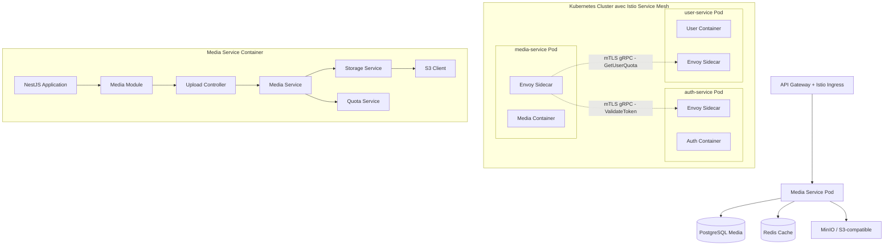
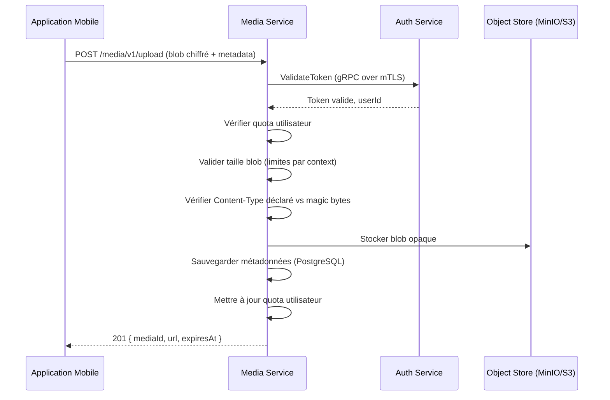

# Media Service (`media-service`) - System Design Document

## 0. Sommaire

- [1. Introduction](#1-introduction)
  - [1.1 Objectif du Document](#11-objectif-du-document)
  - [1.2 Périmètre du Service](#12-périmètre-du-service)
  - [1.3 Relations avec les Autres Services](#13-relations-avec-les-autres-services)
- [2. Architecture Globale](#2-architecture-globale)
  - [2.1 Vue d'Ensemble](#21-vue-densemble)
  - [2.2 Principes Architecturaux](#22-principes-architecturaux)
- [3. Choix Technologiques](#3-choix-technologiques)
  - [3.1 Stack Technique](#31-stack-technique)
  - [3.2 Infrastructure](#32-infrastructure)
- [4. Composants Principaux](#4-composants-principaux)
  - [4.1 Structure NestJS/TypeScript](#41-structure-nestjstypescript)
  - [4.2 Gestionnaire de Médias](#42-gestionnaire-de-médias)
  - [4.3 Gestionnaire de Stockage](#43-gestionnaire-de-stockage)
  - [4.4 Politique d'Accès par Contexte](#44-politique-daccès-par-contexte)
  - [4.5 Communication inter-services via Istio Service Mesh](#45-communication-inter-services-via-istio-service-mesh)
- [5. Chiffrement E2E et Médias](#5-chiffrement-e2e-et-médias)
  - [5.1 Modèle de Chiffrement Signal](#51-modèle-de-chiffrement-signal)
  - [5.2 Ce que le Serveur Voit](#52-ce-que-le-serveur-voit)
  - [5.3 Pipeline de Traitement Côté Client](#53-pipeline-de-traitement-côté-client)
  - [5.4 Thumbnails et Previews](#54-thumbnails-et-previews)
- [6. API](#6-api)
  - [6.1 Endpoint d'Upload](#61-endpoint-dupload)
  - [6.2 Autres Endpoints](#62-autres-endpoints)
  - [6.3 Structure de Réponse](#63-structure-de-réponse)
- [7. Modération](#7-modération)
  - [7.1 Modération Embarquée Côté Client](#71-modération-embarquée-côté-client)
  - [7.2 Ce que le Serveur Peut Vérifier](#72-ce-que-le-serveur-peut-vérifier)
- [8. Scaling et Performances](#8-scaling-et-performances)
  - [8.1 Stratégie de Scaling](#81-stratégie-de-scaling)
  - [8.2 Cache et Optimisations](#82-cache-et-optimisations)
  - [8.3 Limites et Quotas](#83-limites-et-quotas)
- [9. Monitoring et Observabilité](#9-monitoring-et-observabilité)
- [10. Gestion des Erreurs et Résilience](#10-gestion-des-erreurs-et-résilience)
- [11. Évolution et Maintenance](#11-évolution-et-maintenance)
- [Appendices](#appendices)

---

## 1. Introduction

### 1.1 Objectif du Document
Ce document décrit l'architecture et la conception technique du service de gestion des médias (`media-service`) de l'application Whispr. Il sert de référence pour l'équipe de développement et les parties prenantes du projet.

### 1.2 Périmètre du Service
Le Media Service est un **store-and-forward aveugle** : il reçoit, stocke et distribue des blobs chiffrés sans jamais accéder à leur contenu. Il est responsable de :

- La réception et le stockage des blobs chiffrés (Signal Protocol)
- Le contrôle d'accès aux médias via URLs signées
- La gestion des quotas par utilisateur
- La distribution des médias selon leur politique d'accès (`context`)

Il n'est **pas** responsable de :
- La compression ou le resize des médias (délégué au client)
- La génération de previews/thumbnails côté serveur (délégué au client)
- La modération du contenu (modèle embarqué dans l'app mobile)
- Le scan antivirus du contenu (impossible sur des blobs chiffrés)

### 1.3 Relations avec les Autres Services
Le Media Service interagit via Istio Service Mesh avec :
- **auth-service** : validation des tokens JWT
- **user-service** : informations de quota utilisateur

Il n'a **pas** de dépendance vers le messaging-service. Les médias existent indépendamment des messages : c'est le messaging-service qui référence les `mediaId`, pas l'inverse.

---

## 2. Architecture Globale

### 2.1 Vue d'Ensemble


```mermaid
graph TD
    A[API Gateway + Istio Ingress] --> B[Media Service Pod]

    subgraph "Kubernetes Cluster avec Istio Service Mesh"
        subgraph "media-service Pod"
            B1[Media Container]
            B2[Envoy Sidecar]
        end

        subgraph "auth-service Pod"
            C1[Auth Container]
            C2[Envoy Sidecar]
        end

        subgraph "user-service Pod"
            E1[User Container]
            E2[Envoy Sidecar]
        end

        B2 -.->|"mTLS gRPC - ValidateToken"| C2
        B2 -.->|"mTLS gRPC - GetUserQuota"| E2
    end

    B --> F[(PostgreSQL Media)]
    B --> G[(Redis Cache)]
    B --> H[MinIO / S3-compatible]

    subgraph "Media Service Container"
        K[NestJS Application] --> L[Media Module]
        L --> M[Upload Controller]
        M --> N[Media Service]
        N --> O[Storage Service]
        N --> P[Quota Service]
        O --> Q[S3 Client]
    end
```

### 2.2 Principes Architecturaux

- **Store-and-forward aveugle** : le serveur ne déchiffre jamais les blobs Signal
- **Zero Trust Network** : communications inter-services chiffrées via mTLS Istio
- **Namespacing par contexte** : politique d'accès déterminée par le `context` de l'upload
- **Indépendance du messaging** : les médias n'ont pas de référence aux messages/conversations
- **Scaling horizontal** : architecture stateless, aucun état local dans le service
- **Quotas côté serveur** : la taille des blobs est connue même chiffrée, les quotas restent applicables

---

## 3. Choix Technologiques

### 3.1 Stack Technique

- **Langage** : TypeScript
- **Runtime** : Node.js
- **Framework** : NestJS
- **Service Mesh** : Istio (mTLS automatique, circuit breakers)
- **Base de données** : PostgreSQL (métadonnées des médias, quotas)
- **Cache** : Redis (métadonnées fréquentes, quotas, sessions d'upload)
- **Stockage** : MinIO en dev, S3-compatible en prod
- **ORM** : TypeORM
- **API** : REST multipart avec documentation Swagger
- **Testing** : Jest

### 3.2 Infrastructure

- **Containerisation** : Docker
- **Orchestration** : Kubernetes (GKE)
- **Service Mesh** : Istio avec sidecars Envoy
- **CI/CD** : GitHub Actions
- **Monitoring** : Prometheus + Grafana + Kiali
- **Logging** : Loki + logs Envoy
- **Tracing** : Jaeger

---

## 4. Composants Principaux

### 4.1 Structure NestJS/TypeScript

```
src/
├── app.module.ts
├── main.ts
├── config/
│   ├── database.config.ts
│   ├── s3.config.ts
│   └── redis.config.ts
├── modules/
│   ├── media/
│   │   ├── media.module.ts
│   │   ├── controllers/
│   │   │   ├── upload.controller.ts       # POST /media/v1/upload
│   │   │   └── download.controller.ts     # GET /media/v1/:id
│   │   ├── services/
│   │   │   ├── media.service.ts           # Orchestration principale
│   │   │   ├── storage.service.ts         # Interface S3/MinIO
│   │   │   └── quota.service.ts           # Vérification et mise à jour des quotas
│   │   ├── entities/
│   │   │   └── media.entity.ts
│   │   └── dto/
│   │       ├── upload-media.dto.ts
│   │       └── media-response.dto.ts
│   ├── grpc/
│   │   └── clients/
│   │       ├── auth.client.ts
│   │       └── user.client.ts
│   ├── auth/
│   │   └── guards/
│   │       └── jwt-auth.guard.ts
│   └── common/
│       ├── filters/
│       │   └── http-exception.filter.ts
│       └── interceptors/
│           ├── logging.interceptor.ts
│           └── timeout.interceptor.ts
```

> Les services `compression.service.ts`, `preview.service.ts` et `moderation.service.ts` présents dans les versions précédentes ont été supprimés — ces responsabilités sont portées par le client mobile.

### 4.2 Gestionnaire de Médias

Le flux d'upload est simplifié par rapport à une architecture sans E2E :


```mermaid
sequenceDiagram
    participant Client as Application Mobile
    participant MediaService as Media Service
    participant AuthService as Auth Service
    participant S3 as Object Store (MinIO/S3)

    Client->>MediaService: POST /media/v1/upload (blob chiffré + metadata)
    MediaService->>AuthService: ValidateToken (gRPC over mTLS)
    AuthService-->>MediaService: Token valide, userId

    MediaService->>MediaService: Vérifier quota utilisateur
    MediaService->>MediaService: Valider taille blob (limites par context)
    MediaService->>MediaService: Vérifier Content-Type déclaré vs magic bytes

    MediaService->>S3: Stocker blob opaque
    MediaService->>MediaService: Sauvegarder métadonnées (PostgreSQL)
    MediaService->>MediaService: Mettre à jour quota utilisateur

    MediaService-->>Client: 201 { mediaId, url, expiresAt }
```

### 4.3 Gestionnaire de Stockage

- **Buckets/préfixes séparés par context** : `avatars/`, `messages/`, `group_icons/`
- **Lifecycle policies** : expiration automatique des blobs `messages/` après TTL configurable
- **Accès** : signed URLs pour `messages/` et `group_icons/`, URLs publiques pour `avatars/`
- **Streaming** : upload/download en streaming pour limiter l'empreinte mémoire

### 4.4 Politique d'Accès par Contexte

Le `context` passé à l'upload détermine la politique de stockage et d'accès :

| context | Stockage | URL retournée | expiresAt | Audience |
|---|---|---|---|---|
| `message` | `messages/{userId}/{uuid}` | Signed URL (courte durée) | timestamp (ex: +7j) | Destinataires Signal |
| `avatar` | `avatars/{userId}/{uuid}` | URL publique permanente | `null` | Public |
| `group_icon` | `group_icons/{groupId}/{uuid}` | URL publique permanente | `null` | Membres du groupe |

Les blobs `message` sont chiffrés Signal — l'URL expirante ajoute une couche de contrôle d'accès côté serveur, même si le contenu est déjà chiffré. Les blobs `avatar` et `group_icon` peuvent être chiffrés côté serveur (AES-256-GCM, clé serveur) ou en clair selon la politique de déploiement — ils ne sont pas des médias Signal.

### 4.5 Communication inter-services via Istio Service Mesh

**Interfaces gRPC consommées** :
- **auth-service** : `ValidateToken`, `GetUserInfo`
- **user-service** : `GetUserQuotas`, `UpdateStorageUsage`

**Interfaces REST exposées** :
- `POST /media/v1/upload` — upload multipart
- `GET /media/v1/:id` — récupération métadonnées
- `GET /media/v1/:id/blob` — téléchargement blob (redirect vers signed URL)
- `DELETE /media/v1/:id` — suppression
- `GET /media/v1/quota` — quota courant de l'utilisateur authentifié

```yaml
# AuthorizationPolicy pour clients vers media-service
apiVersion: security.istio.io/v1beta1
kind: AuthorizationPolicy
metadata:
  name: clients-to-media
  namespace: whispr
spec:
  selector:
    matchLabels:
      app: media-service
  rules:
  - from:
    - source:
        principals: ["cluster.local/ns/whispr/sa/api-gateway"]
  - to:
    - operation:
        methods: ["GET", "POST", "DELETE"]
        paths: ["/media/v1/*"]
```

---

## 5. Chiffrement E2E et Médias

### 5.1 Modèle de Chiffrement Signal

Les médias de type `message` suivent le protocole Signal :

1. **Côté client expéditeur** : génération d'une clé symétrique aléatoire → chiffrement du fichier (AES-256-CBC + HMAC-SHA256, enveloppe Signal) → upload du blob opaque
2. **Transmission de la clé** : la clé symétrique est transmise **dans le message Signal** (canal chiffré E2E), jamais via le media-service
3. **Côté client destinataire** : récupération du blob via signed URL → déchiffrement local avec la clé reçue via Signal

Le media-service ne voit jamais les clés de déchiffrement. Il est structurellement incapable de lire le contenu des médias `message`.

```
Client A                      media-service                Client B
   |                               |                           |
   |  génère clé K                 |                           |
   |  chiffre fichier → blob       |                           |
   |  POST /upload (blob)  ------> |                           |
   |                          stocke blob opaque               |
   |  <-- { mediaId, url } ------- |                           |
   |                               |                           |
   |  Signal message: { mediaId, url, K } ------------------>  |
   |                               |                           |
   |                               | <-- GET /blob/:id ------- |
   |                               | -- blob chiffré --------> |
   |                               |              déchiffre avec K
```

### 5.2 Ce que le Serveur Voit

Le media-service a uniquement accès aux métadonnées **non sensibles** fournies par le client :

| Donnée | Visible par le serveur | Note |
|---|---|---|
| Taille du blob | ✅ | Nécessaire pour les quotas |
| Content-Type déclaré | ✅ | Vérifié via magic bytes sur le blob |
| `context` | ✅ | Détermine la politique d'accès |
| `ownerId` | ✅ | Propriétaire du média |
| Contenu du fichier | ❌ | Chiffré, opaque |
| Métadonnées EXIF | ❌ | Incluses dans le blob chiffré |
| Thumbnail/preview | ❌ sauf si uploadé séparément | Voir §5.4 |

### 5.3 Pipeline de Traitement Côté Client

Toute la pipeline de traitement se fait **avant chiffrement, sur le device** :

```
Fichier original
      │
      ▼
Resize / compression (Sharp mobile / FFmpeg mobile)
      │
      ▼
Génération thumbnail (si applicable)
      │
      ├──── Chiffrement thumbnail (clé K) ──────────────► upload blob thumbnail
      │
      ▼
Chiffrement fichier principal (clé K, Signal envelope)
      │
      ▼
Upload blob principal → media-service
```

La contrainte principale est la **consommation CPU/batterie** sur mobile pour les vidéos lourdes. L'application doit implémenter une compression agressive avant envoi (ex: résolution max 1080p, bitrate adaptatif).

### 5.4 Thumbnails et Previews

Le client peut uploader un thumbnail chiffré séparément, lié au média principal :

```
POST /media/v1/upload
Body:
  file: <blob chiffré principal>
  thumbnail: <blob chiffré thumbnail> (optionnel)
  context: "message"
  ownerId: <userId>
```

Le thumbnail est stocké sous `thumbnails/{mediaId}` et retourné dans la réponse :

```json
{
  "mediaId": "uuid",
  "url": "https://cdn.whispr.../messages/uuid",
  "thumbnailUrl": "https://cdn.whispr.../thumbnails/uuid",
  "expiresAt": "2026-03-20T00:00:00Z"
}
```

Si aucun thumbnail n'est fourni, le client affiche une icône générique selon le type MIME déclaré.

---

## 6. API

### 6.1 Endpoint d'Upload

```
POST /media/v1/upload
Content-Type: multipart/form-data
Authorization: Bearer <jwt>

Champs:
  file        (required)  blob chiffré principal
  thumbnail   (optional)  blob chiffré thumbnail
  context     (required)  "message" | "avatar" | "group_icon"
  ownerId     (required)  userId ou groupId selon context
```

**Validations côté serveur** :
- Taille max par context (voir §8.3)
- Magic bytes : vérification que le Content-Type déclaré correspond aux premiers octets du blob
- Quota utilisateur non dépassé
- Token JWT valide

### 6.2 Autres Endpoints

```
GET    /media/v1/:id           # Métadonnées du média
GET    /media/v1/:id/blob      # Redirect vers signed URL du blob
GET    /media/v1/:id/thumbnail # Redirect vers signed URL du thumbnail
DELETE /media/v1/:id           # Suppression (propriétaire ou admin)
GET    /media/v1/quota         # Quota courant de l'utilisateur
```

### 6.3 Structure de Réponse

```json
{
  "mediaId": "550e8400-e29b-41d4-a716-446655440000",
  "url": "https://cdn.whispr.epitech.beer/messages/uuid.bin?sig=...",
  "thumbnailUrl": "https://cdn.whispr.epitech.beer/thumbnails/uuid.bin?sig=...",
  "expiresAt": "2026-03-20T00:00:00Z",
  "context": "message",
  "size": 1048576
}
```

`expiresAt` est `null` pour `avatar` et `group_icon`. Le `mediaId` est ensuite référencé dans le message Signal — le media-service est la source de vérité pour les URLs.

---

## 7. Modération

### 7.1 Modération Embarquée Côté Client

La modération de contenu est effectuée **sur le device**, par un modèle ML embarqué dans l'application mobile, **avant chiffrement**. Le serveur ne peut pas analyser le contenu des blobs Signal.

Ce choix est cohérent avec le modèle de WhatsApp et Signal : la modération repose sur :
1. L'analyse locale avant envoi (modèle embarqué)
2. Le signalement post-factum par les destinataires

Le `moderation-service` n'est **pas** appelé par le media-service.

### 7.2 Ce que le Serveur Peut Vérifier

Sans accès au contenu, le serveur peut uniquement vérifier :

- **Taille et type MIME** : validation structurelle du blob
- **Quotas** : protection contre l'abus de stockage
- **Rate limiting** : protection contre le spam d'uploads
- **Hash du blob chiffré** : déduplication des blobs identiques (même fichier re-uploadé à l'identique), mais pas de détection de contenu similaire

> La table `MODERATION_HASHES` présente dans les anciennes versions de la doc a été supprimée — elle n'est plus pertinente avec ce modèle. Le cache de déduplication est géré en Redis avec TTL.

---

## 8. Scaling et Performances

### 8.1 Stratégie de Scaling

- **Horizontal Pod Autoscaling** : scaling sur CPU et taux d'upload
- **Istio Load Balancing** : distribution intelligente
- **Circuit Breakers** : protection contre auth-service et user-service défaillants
- Pas de pods spécialisés pour le traitement image/vidéo (supprimés — traitement client)

### 8.2 Cache et Optimisations

- **Metadata Cache** : Redis TTL 30min pour les métadonnées fréquentes
- **Quota Cache** : Redis TTL 1h pour les limites utilisateur
- **Streaming** : upload/download en streaming, pas de buffering en mémoire
- **Connection Pooling** : pools vers PostgreSQL et S3

### 8.3 Limites et Quotas

| Métrique | Limite | Contexte |
|---|---|---|
| Taille blob `message` | 100 MB | Vidéos, documents |
| Taille blob `avatar` | 5 MB | Image compressée côté client |
| Taille blob `group_icon` | 5 MB | Image compressée côté client |
| Uploads par utilisateur/jour | 100 fichiers | Rate limiting |
| Stockage total par utilisateur | 1 GB | Quota persistant |
| Requêtes par minute | 60 | Rate limiting Istio |
| Concurrent uploads | 3 par utilisateur | Semaphore |

---

## 9. Monitoring et Observabilité

- **Kiali** : visualisation flux inter-services
- **Jaeger** : tracing distribué
- **Prometheus** : métriques Istio + métriques custom
- **Grafana** : dashboards

**Métriques métier** :
- Débit d'upload par context
- Taille moyenne des blobs par context
- Utilisation stockage par utilisateur
- Taux d'erreur upload / quota dépassé
- Latence des appels gRPC vers auth-service et user-service

---

## 10. Gestion des Erreurs et Résilience

- **Exception Filters NestJS** : gestion centralisée des erreurs
- **Circuit Breakers Istio** : protection contre auth-service défaillant (fallback sur cache JWT)
- **Retry Policies** : retries automatiques avec backoff exponentiel vers user-service
- **Graceful shutdown** : arrêt propre avec drain des connexions en cours
- **RPO** : 5 minutes (métadonnées PostgreSQL)
- **RTO** : 10 minutes

---

## 11. Évolution et Maintenance

- **API Versioning** : préfixe `/media/v1/` — la v2 pourra coexister
- **Blue/Green Deployment** : via Istio, zéro downtime
- **Canary Releases** : déploiement progressif sur sous-ensemble de trafic
- **Migrations TypeORM** : zero-downtime, backward-compatible

---

## Appendices

### A. Métriques de Performance Cibles

| Métrique | Cible |
|---|---|
| Temps upload blob < 5MB | < 2s (hors transfert réseau) |
| 99e percentile temps de réponse | < 5s |
| Taux d'erreur upload | < 1% |
| Disponibilité | > 99.5% |

### B. Estimation des Ressources

| Ressource | Estimation |
|---|---|
| Pods media-service | 2-3 instances |
| CPU par pod | 2 vCPU + 0.2 vCPU (Envoy) |
| Mémoire par pod | 512 MB + 200 MB (Envoy) |
| Stockage PostgreSQL | 10 GB initial (métadonnées uniquement) |
| Stockage Redis | 1 GB |
| Stockage objet (blobs) | 100 GB initial |

> La mémoire par pod est significativement réduite par rapport aux estimations précédentes : sans pipeline Sharp/FFmpeg, le service est principalement I/O-bound.

### C. Références

- [MinIO Documentation](https://min.io/docs/)
- [NestJS Documentation](https://docs.nestjs.com/)
- [Signal Protocol — Media Encryption](https://signal.org/docs/)
- [Istio Security Best Practices](https://istio.io/latest/docs/ops/best-practices/security/)
