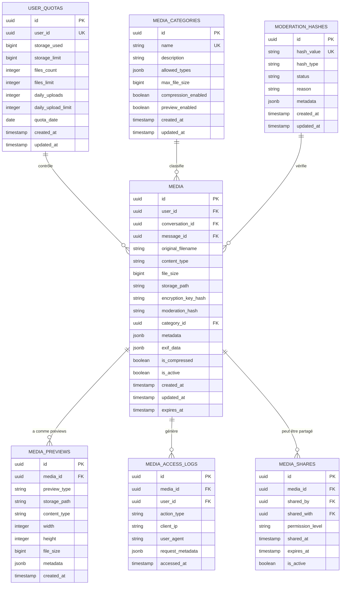
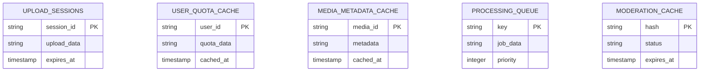
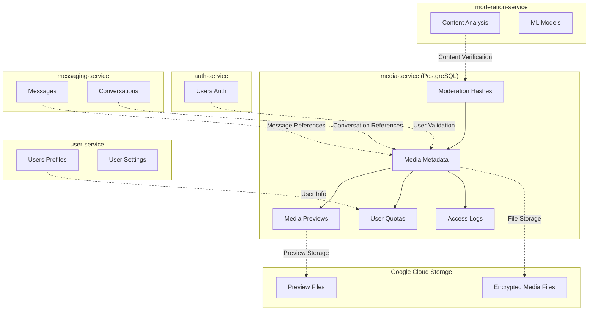
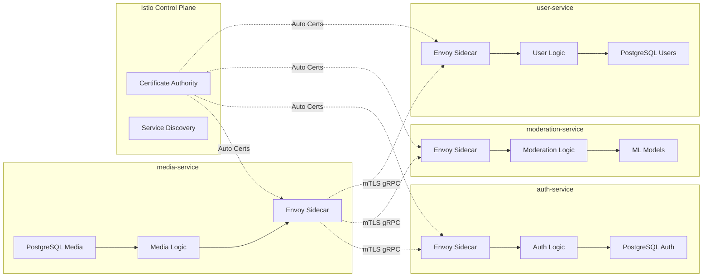

# Media Service (`media-service`) - Conception de la Base de Données

## 0. Sommaire

- [1. Introduction et Principes de Conception](#1-introduction-et-principes-de-conception)
  - [1.1 Objectif](#11-objectif)
  - [1.2 Principes Architecturaux](#12-principes-architecturaux)
  - [1.3 Technologie](#13-technologie)
- [2. Schéma PostgreSQL du Service de Médias](#2-schéma-postgresql-du-service-de-médias)
  - [2.1 Vue d'Ensemble](#21-vue-densemble)
  - [2.2 Description des Tables](#22-description-des-tables)
- [3. Données Temporaires dans Redis](#3-données-temporaires-dans-redis)
  - [3.1 Vue d'Ensemble](#31-vue-densemble)
  - [3.2 Description des Structures Redis](#32-description-des-structures-redis)
- [4. Relations avec les Autres Services](#4-relations-avec-les-autres-services)
  - [4.1 Démarcation des Responsabilités](#41-démarcation-des-responsabilités)
  - [4.2 Synchronisation des Données](#42-synchronisation-des-données)
- [5. Considérations de Sécurité](#5-considérations-de-sécurité)
  - [5.1 Chiffrement des Médias](#51-chiffrement-des-médias)
  - [5.2 Protection des Métadonnées](#52-protection-des-métadonnées)
  - [5.3 Audit et Logging](#53-audit-et-logging)
- [6. Considérations de Performance](#6-considérations-de-performance)
  - [6.1 Indexation](#61-indexation)
  - [6.2 Partitionnement](#62-partitionnement)
  - [6.3 Optimisations Redis](#63-optimisations-redis)
- [7. Migrations et Évolution du Schéma](#7-migrations-et-évolution-du-schéma)
  - [7.1 Stratégie de Migration](#71-stratégie-de-migration)
- [8. Scripts SQL d'Initialisation](#8-scripts-sql-dinitialisation)
  - [8.1 Création du Schéma PostgreSQL](#81-création-du-schéma-postgresql)
- [9. Communication Inter-Services avec Istio](#9-communication-inter-services-avec-istio)
  - [9.1 Architecture Service Mesh pour les Données](#91-architecture-service-mesh-pour-les-données)
  - [9.2 Événements et Synchronisation avec mTLS](#92-événements-et-synchronisation-avec-mtls)
  - [9.3 Gestion des Références Externes avec Istio](#93-gestion-des-références-externes-avec-istio)
  - [9.4 Monitoring des Données Inter-Services](#94-monitoring-des-données-inter-services)
  - [9.5 Résilience des Données](#95-résilience-des-données)

## 1. Introduction et Principes de Conception

### 1.1 Objectif
Ce document décrit la structure de la base de données du service de gestion des médias (media-service) de l'application Whispr, en détaillant les modèles de données, les relations, et les considérations de performance pour la gestion des fichiers multimédias, du stockage chiffré, des quotas utilisateur et de la modération de contenu.

### 1.2 Principes Architecturaux
- **Séparation métadonnées/contenu** : Métadonnées en PostgreSQL, fichiers chiffrés en Google Cloud Storage
- **Chiffrement bout-en-bout** : Tous les médias chiffrés côté client avant stockage
- **Modération préventive** : Hash de modération calculé avant acceptation
- **Quotas stricts** : Gestion rigoureuse des limites par utilisateur
- **Performance optimisée** : Indexation et cache pour accès rapide aux métadonnées
- **Traçabilité complète** : Audit des opérations sur les médias
- **Intégrité référentielle** : Liens cohérents avec les autres services

### 1.3 Technologie
- **PostgreSQL** : Pour le stockage des métadonnées, quotas et historique
- **Prisma** : ORM pour NestJS utilisé pour l'accès aux données
- **Redis** : Pour les données temporaires, cache des quotas et coordination
- **Google Cloud Storage** : Stockage des fichiers chiffrés (hors base de données)

## 2. Schéma PostgreSQL du Service de Médias

### 2.1 Vue d'Ensemble



### 2.2 Description des Tables

#### 2.2.1 MEDIA
Stocke les métadonnées principales des fichiers multimédias.

| Colonne | Type | Description | Contraintes |
|---------|------|-------------|-------------|
| id | UUID | Identifiant unique du média | PK, NOT NULL |
| user_id | UUID | Propriétaire du média | NOT NULL |
| conversation_id | UUID | Conversation liée (peut être NULL) | NULL |
| message_id | UUID | Message lié (peut être NULL) | NULL |
| original_filename | VARCHAR(255) | Nom de fichier original | NOT NULL |
| content_type | VARCHAR(100) | Type MIME du fichier | NOT NULL |
| file_size | BIGINT | Taille du fichier en octets | NOT NULL |
| storage_path | VARCHAR(500) | Chemin dans Google Cloud Storage | NOT NULL, UNIQUE |
| encryption_key_hash | VARCHAR(128) | Hash de la clé de chiffrement | NOT NULL |
| moderation_hash | VARCHAR(128) | Hash pour modération | NOT NULL |
| category_id | UUID | Référence à la catégorie | FK, NOT NULL |
| metadata | JSONB | Métadonnées techniques | NOT NULL, DEFAULT '{}' |
| exif_data | JSONB | Données EXIF pour images | NOT NULL, DEFAULT '{}' |
| is_compressed | BOOLEAN | Fichier compressé | NOT NULL, DEFAULT FALSE |
| is_active | BOOLEAN | Média actif | NOT NULL, DEFAULT TRUE |
| created_at | TIMESTAMP | Date/heure de création | NOT NULL |
| updated_at | TIMESTAMP | Date/heure de mise à jour | NOT NULL |
| expires_at | TIMESTAMP | Date d'expiration (optionnelle) | NULL |

**Indices** :
- PRIMARY KEY sur `id`
- INDEX sur `user_id` pour récupération par utilisateur
- INDEX sur `(conversation_id, message_id)` pour intégration messaging
- INDEX sur `moderation_hash` pour vérification rapide
- INDEX sur `created_at` pour tri chronologique
- INDEX sur `is_active` pour filtrage
- UNIQUE sur `storage_path` pour éviter les doublons

#### 2.2.2 MEDIA_PREVIEWS
Stocke les métadonnées des previews générés (thumbnails, waveforms, etc.).

| Colonne | Type | Description | Contraintes |
|---------|------|-------------|-------------|
| id | UUID | Identifiant unique du preview | PK, NOT NULL |
| media_id | UUID | Référence au média parent | FK, NOT NULL |
| preview_type | VARCHAR(50) | Type de preview | NOT NULL |
| storage_path | VARCHAR(500) | Chemin dans GCS | NOT NULL, UNIQUE |
| content_type | VARCHAR(100) | Type MIME du preview | NOT NULL |
| width | INTEGER | Largeur en pixels (images/vidéos) | NULL |
| height | INTEGER | Hauteur en pixels (images/vidéos) | NULL |
| file_size | BIGINT | Taille du preview en octets | NOT NULL |
| metadata | JSONB | Métadonnées spécifiques | NOT NULL, DEFAULT '{}' |
| created_at | TIMESTAMP | Date/heure de création | NOT NULL |

**Indices** :
- PRIMARY KEY sur `id`
- INDEX sur `media_id` pour récupération par média
- INDEX sur `preview_type` pour filtrage par type
- UNIQUE sur `storage_path`

#### 2.2.3 USER_QUOTAS
Gestion des quotas de stockage par utilisateur.

| Colonne | Type | Description | Contraintes |
|---------|------|-------------|-------------|
| id | UUID | Identifiant unique du quota | PK, NOT NULL |
| user_id | UUID | Identifiant de l'utilisateur | UNIQUE, NOT NULL |
| storage_used | BIGINT | Stockage utilisé en octets | NOT NULL, DEFAULT 0 |
| storage_limit | BIGINT | Limite de stockage en octets | NOT NULL, DEFAULT 1073741824 |
| files_count | INTEGER | Nombre de fichiers | NOT NULL, DEFAULT 0 |
| files_limit | INTEGER | Limite de fichiers | NOT NULL, DEFAULT 1000 |
| daily_uploads | INTEGER | Uploads du jour | NOT NULL, DEFAULT 0 |
| daily_upload_limit | INTEGER | Limite uploads par jour | NOT NULL, DEFAULT 100 |
| quota_date | DATE | Date du quota quotidien | NOT NULL |
| created_at | TIMESTAMP | Date/heure de création | NOT NULL |
| updated_at | TIMESTAMP | Date/heure de mise à jour | NOT NULL |

**Indices** :
- PRIMARY KEY sur `id`
- UNIQUE sur `user_id`
- INDEX sur `quota_date` pour réinitialisation quotidienne
- INDEX sur `storage_used` pour monitoring

#### 2.2.4 MEDIA_CATEGORIES
Définition des catégories de médias avec leurs contraintes.

| Colonne | Type | Description | Contraintes |
|---------|------|-------------|-------------|
| id | UUID | Identifiant unique de la catégorie | PK, NOT NULL |
| name | VARCHAR(50) | Nom de la catégorie | UNIQUE, NOT NULL |
| description | TEXT | Description de la catégorie | NULL |
| allowed_types | JSONB | Types MIME autorisés | NOT NULL |
| max_file_size | BIGINT | Taille maximale en octets | NOT NULL |
| compression_enabled | BOOLEAN | Compression activée | NOT NULL, DEFAULT TRUE |
| preview_enabled | BOOLEAN | Génération de preview activée | NOT NULL, DEFAULT TRUE |
| created_at | TIMESTAMP | Date/heure de création | NOT NULL |
| updated_at | TIMESTAMP | Date/heure de mise à jour | NOT NULL |

**Indices** :
- PRIMARY KEY sur `id`
- UNIQUE sur `name`
- INDEX sur `name` pour recherche rapide

#### 2.2.5 MEDIA_ACCESS_LOGS
Journalisation des accès aux médias pour audit et sécurité.

| Colonne | Type | Description | Contraintes |
|---------|------|-------------|-------------|
| id | UUID | Identifiant unique du log | PK, NOT NULL |
| media_id | UUID | Référence au média | FK, NOT NULL |
| user_id | UUID | Utilisateur ayant accédé | NOT NULL |
| action_type | VARCHAR(50) | Type d'action | NOT NULL |
| client_ip | INET | Adresse IP du client | NOT NULL |
| user_agent | VARCHAR(500) | User agent du client | NULL |
| request_metadata | JSONB | Métadonnées de la requête | NOT NULL, DEFAULT '{}' |
| accessed_at | TIMESTAMP | Date/heure d'accès | NOT NULL |

**Contraintes** :
- PRIMARY KEY sur `id`
- PARTITION BY RANGE sur `accessed_at` (partitionnement mensuel)

#### 2.2.6 MEDIA_SHARES
Gestion du partage de médias entre utilisateurs.

| Colonne | Type | Description | Contraintes |
|---------|------|-------------|-------------|
| id | UUID | Identifiant unique du partage | PK, NOT NULL |
| media_id | UUID | Référence au média | FK, NOT NULL |
| shared_by | UUID | Utilisateur partageant | NOT NULL |
| shared_with | UUID | Utilisateur destinataire | NOT NULL |
| permission_level | VARCHAR(20) | Niveau de permission | NOT NULL, DEFAULT 'view' |
| shared_at | TIMESTAMP | Date/heure de partage | NOT NULL |
| expires_at | TIMESTAMP | Date d'expiration | NULL |
| is_active | BOOLEAN | Partage actif | NOT NULL, DEFAULT TRUE |

**Indices** :
- PRIMARY KEY sur `id`
- INDEX sur `media_id` pour récupération par média
- INDEX sur `shared_with` pour récupération par destinataire
- INDEX sur `expires_at` pour nettoyage automatique

#### 2.2.7 MODERATION_HASHES
Cache des hash de modération pour éviter la re-vérification.

| Colonne | Type | Description | Contraintes |
|---------|------|-------------|-------------|
| id | UUID | Identifiant unique | PK, NOT NULL |
| hash_value | VARCHAR(128) | Valeur du hash | UNIQUE, NOT NULL |
| hash_type | VARCHAR(20) | Type de hash | NOT NULL |
| status | VARCHAR(20) | Statut de modération | NOT NULL |
| reason | TEXT | Raison du statut | NULL |
| metadata | JSONB | Métadonnées supplémentaires | NOT NULL, DEFAULT '{}' |
| created_at | TIMESTAMP | Date/heure de création | NOT NULL |
| updated_at | TIMESTAMP | Date/heure de mise à jour | NOT NULL |

**Indices** :
- PRIMARY KEY sur `id`
- UNIQUE sur `hash_value`
- INDEX sur `status` pour filtrage
- INDEX sur `hash_type` pour recherche par type

## 3. Données Temporaires dans Redis

### 3.1 Vue d'Ensemble

Redis est utilisé pour les données à accès fréquent, les quotas en temps réel et la coordination des opérations :



### 3.2 Description des Structures Redis

#### 3.2.1 UPLOAD_SESSIONS
Sessions d'upload pour gérer les uploads multipart et reprises.

**Clé** : `upload:session:{sessionId}`  
**Type** : Hash  
**TTL** : 24 heures  
**Champs** :
- `user_id` : identifiant de l'utilisateur
- `filename` : nom du fichier original
- `total_size` : taille totale attendue
- `uploaded_chunks` : chunks déjà uploadés
- `metadata` : métadonnées temporaires
- `encryption_key` : clé de chiffrement temporaire

#### 3.2.2 USER_QUOTA_CACHE
Cache des quotas utilisateur pour validation rapide.

**Clé** : `quota:user:{userId}`  
**Type** : Hash  
**TTL** : 1 heure  
**Champs** :
- `storage_used` : stockage utilisé en octets
- `storage_limit` : limite de stockage
- `files_count` : nombre de fichiers
- `daily_uploads` : uploads du jour
- `last_updated` : timestamp de dernière mise à jour

#### 3.2.3 MEDIA_METADATA_CACHE
Cache des métadonnées fréquemment accédées.

**Clé** : `media:metadata:{mediaId}`  
**Type** : Hash  
**TTL** : 30 minutes  
**Champs** :
- `content_type` : type MIME
- `file_size` : taille du fichier
- `user_id` : propriétaire
- `category` : catégorie du média
- `previews` : liste des previews disponibles

#### 3.2.4 PROCESSING_QUEUE
Files d'attente pour le traitement asynchrone.

**Clé** : `queue:processing:{priority}`  
**Type** : Sorted Set  
**TTL** : 48 heures  
**Valeurs** :
- Jobs de compression sérialisés en JSON
- Score : timestamp + priorité
- Supports multiples priorités (high, medium, low)

#### 3.2.5 MODERATION_CACHE
Cache des résultats de modération pour éviter les re-vérifications.

**Clé** : `moderation:hash:{hashValue}`  
**Type** : String  
**TTL** : 7 jours  
**Valeur** : Statut de modération (approved, rejected, pending)

## 4. Relations avec les Autres Services

### 4.1 Démarcation des Responsabilités



### 4.2 Synchronisation des Données

- **auth-service** : Validation des utilisateurs pour les opérations de média
  - Vérification des tokens d'authentification
  - Pas de réplication des données utilisateur

- **user-service** : Source des informations utilisateur
  - Récupération des paramètres de quota personnalisés
  - Synchronisation des limites de stockage

- **messaging-service** : Intégration pour les médias dans les messages
  - Liens vers conversations et messages
  - Événements de suppression de message

- **moderation-service** : Service de validation de contenu
  - Vérification des hash de modération
  - Analyse du contenu multimédia

## 5. Considérations de Sécurité

### 5.1 Chiffrement des Médias

- **Chiffrement côté client** : Tous les fichiers chiffrés avant upload avec AES-256-GCM
- **Clés par utilisateur** : Dérivation PBKDF2 avec salt unique par utilisateur
- **Hash des clés** : Stockage du hash de la clé de chiffrement (jamais la clé elle-même)
- **Intégrité** : Tag d'authentification GCM pour vérifier l'intégrité
- **Rotation** : Support de la rotation des clés de chiffrement

### 5.2 Protection des Métadonnées

- **Chiffrement au repos** : Base de données PostgreSQL chiffrée (TDE)
- **Données sensibles** : EXIF data chiffrées au niveau colonne
- **Anonymisation logs** : Pas d'informations personnelles dans les logs de debug
- **Accès contrôlé** : Row Level Security pour isolation par utilisateur

### 5.3 Audit et Logging

- **Traçabilité complète** : Tous les accès aux médias loggés
- **Intégrité logs** : Protection contre la falsification
- **Rétention** : Politique de rétention différenciée selon la sensibilité
- **Anonymisation** : Données personnelles anonymisées dans les analyses

## 6. Considérations de Performance

### 6.1 Indexation

- Index composites pour les requêtes fréquentes (`user_id`, `created_at`)
- Index partiels pour les médias actifs (`WHERE is_active = true`)
- Index sur les timestamps pour les requêtes temporelles
- Index GIN sur les colonnes JSONB pour recherche dans les métadonnées
- Index B-tree sur `moderation_hash` pour vérification rapide

### 6.2 Partitionnement

```sql
-- Partitionnement des logs d'accès par mois
CREATE TABLE media_access_logs (
    id UUID NOT NULL,
    accessed_at TIMESTAMP NOT NULL,
    -- autres colonnes
    PRIMARY KEY (accessed_at, id)
) PARTITION BY RANGE (accessed_at);

-- Partitions mensuelles automatiques
CREATE TABLE media_access_logs_2025_01 PARTITION OF media_access_logs
    FOR VALUES FROM ('2025-01-01') TO ('2025-02-01');
```

### 6.3 Optimisations Redis

- TTL optimisés selon l'usage des données
- Pipeline Redis pour les opérations en lot sur les quotas
- Compression des métadonnées en cache
- Sharding Redis pour la haute disponibilité
- Éviction LRU pour les caches de métadonnées

## 7. Migrations et Évolution du Schéma

### 7.1 Stratégie de Migration

- **Migrations Prisma** : Migrations progressives avec versionnement
- **Zero Downtime** : Migrations compatibles avec le déploiement sans interruption
- **Rollback** : Possibilité de rollback pour toutes les migrations
- **Tests automatisés** : Validation automatique des migrations
- **Migration des données** : Scripts pour migration des fichiers existants

```typescript
// Exemple de migration Prisma
generator client {
  provider = "prisma-client-js"
}

datasource db {
  provider = "postgresql"
  url      = env("DATABASE_URL")
}

model Media {
  id              String   @id @default(uuid())
  userId          String   @map("user_id")
  originalFilename String  @map("original_filename")
  contentType     String   @map("content_type")
  fileSize        BigInt   @map("file_size")
  storagePath     String   @unique @map("storage_path")
  createdAt       DateTime @default(now()) @map("created_at")
  updatedAt       DateTime @updatedAt @map("updated_at")
  
  previews MediaPreview[]
  
  @@map("media")
}
```

## 8. Scripts SQL d'Initialisation

### 8.1 Création du Schéma PostgreSQL

```sql
CREATE EXTENSION IF NOT EXISTS "uuid-ossp";
CREATE EXTENSION IF NOT EXISTS "pgcrypto";

-- Table des catégories de médias
CREATE TABLE media_categories (
    id UUID PRIMARY KEY DEFAULT uuid_generate_v4(),
    name VARCHAR(50) NOT NULL UNIQUE,
    description TEXT,
    allowed_types JSONB NOT NULL,
    max_file_size BIGINT NOT NULL,
    compression_enabled BOOLEAN NOT NULL DEFAULT TRUE,
    preview_enabled BOOLEAN NOT NULL DEFAULT TRUE,
    created_at TIMESTAMP NOT NULL DEFAULT NOW(),
    updated_at TIMESTAMP NOT NULL DEFAULT NOW()
);

-- Table principale des médias
CREATE TABLE media (
    id UUID PRIMARY KEY DEFAULT uuid_generate_v4(),
    user_id UUID NOT NULL,
    conversation_id UUID,
    message_id UUID,
    original_filename VARCHAR(255) NOT NULL,
    content_type VARCHAR(100) NOT NULL,
    file_size BIGINT NOT NULL,
    storage_path VARCHAR(500) NOT NULL UNIQUE,
    encryption_key_hash VARCHAR(128) NOT NULL,
    moderation_hash VARCHAR(128) NOT NULL,
    category_id UUID NOT NULL REFERENCES media_categories(id),
    metadata JSONB NOT NULL DEFAULT '{}',
    exif_data JSONB NOT NULL DEFAULT '{}',
    is_compressed BOOLEAN NOT NULL DEFAULT FALSE,
    is_active BOOLEAN NOT NULL DEFAULT TRUE,
    created_at TIMESTAMP NOT NULL DEFAULT NOW(),
    updated_at TIMESTAMP NOT NULL DEFAULT NOW(),
    expires_at TIMESTAMP
);

-- Table des previews de médias
CREATE TABLE media_previews (
    id UUID PRIMARY KEY DEFAULT uuid_generate_v4(),
    media_id UUID NOT NULL REFERENCES media(id) ON DELETE CASCADE,
    preview_type VARCHAR(50) NOT NULL,
    storage_path VARCHAR(500) NOT NULL UNIQUE,
    content_type VARCHAR(100) NOT NULL,
    width INTEGER,
    height INTEGER,
    file_size BIGINT NOT NULL,
    metadata JSONB NOT NULL DEFAULT '{}',
    created_at TIMESTAMP NOT NULL DEFAULT NOW()
);

-- Table des quotas utilisateur
CREATE TABLE user_quotas (
    id UUID PRIMARY KEY DEFAULT uuid_generate_v4(),
    user_id UUID NOT NULL UNIQUE,
    storage_used BIGINT NOT NULL DEFAULT 0,
    storage_limit BIGINT NOT NULL DEFAULT 1073741824, -- 1GB
    files_count INTEGER NOT NULL DEFAULT 0,
    files_limit INTEGER NOT NULL DEFAULT 1000,
    daily_uploads INTEGER NOT NULL DEFAULT 0,
    daily_upload_limit INTEGER NOT NULL DEFAULT 100,
    quota_date DATE NOT NULL DEFAULT CURRENT_DATE,
    created_at TIMESTAMP NOT NULL DEFAULT NOW(),
    updated_at TIMESTAMP NOT NULL DEFAULT NOW()
);

-- Table des logs d'accès (partitionnée)
CREATE TABLE media_access_logs (
    id UUID NOT NULL,
    media_id UUID NOT NULL,
    user_id UUID NOT NULL,
    action_type VARCHAR(50) NOT NULL,
    client_ip INET NOT NULL,
    user_agent VARCHAR(500),
    request_metadata JSONB NOT NULL DEFAULT '{}',
    accessed_at TIMESTAMP NOT NULL DEFAULT NOW(),
    PRIMARY KEY (accessed_at, id)
) PARTITION BY RANGE (accessed_at);

-- Partitions initiales pour les logs
CREATE TABLE media_access_logs_2025_01 PARTITION OF media_access_logs
    FOR VALUES FROM ('2025-01-01') TO ('2025-02-01');
CREATE TABLE media_access_logs_2025_02 PARTITION OF media_access_logs
    FOR VALUES FROM ('2025-02-01') TO ('2025-03-01');

-- Table des partages de médias
CREATE TABLE media_shares (
    id UUID PRIMARY KEY DEFAULT uuid_generate_v4(),
    media_id UUID NOT NULL REFERENCES media(id) ON DELETE CASCADE,
    shared_by UUID NOT NULL,
    shared_with UUID NOT NULL,
    permission_level VARCHAR(20) NOT NULL DEFAULT 'view',
    shared_at TIMESTAMP NOT NULL DEFAULT NOW(),
    expires_at TIMESTAMP,
    is_active BOOLEAN NOT NULL DEFAULT TRUE
);

-- Table des hash de modération
CREATE TABLE moderation_hashes (
    id UUID PRIMARY KEY DEFAULT uuid_generate_v4(),
    hash_value VARCHAR(128) NOT NULL UNIQUE,
    hash_type VARCHAR(20) NOT NULL,
    status VARCHAR(20) NOT NULL,
    reason TEXT,
    metadata JSONB NOT NULL DEFAULT '{}',
    created_at TIMESTAMP NOT NULL DEFAULT NOW(),
    updated_at TIMESTAMP NOT NULL DEFAULT NOW()
);

-- Index essentiels
CREATE INDEX idx_media_user_id ON media(user_id);
CREATE INDEX idx_media_conversation_message ON media(conversation_id, message_id);
CREATE INDEX idx_media_moderation_hash ON media(moderation_hash);
CREATE INDEX idx_media_created_at ON media(created_at);
CREATE INDEX idx_media_is_active ON media(is_active);
CREATE INDEX idx_media_previews_media_id ON media_previews(media_id);
CREATE INDEX idx_media_previews_type ON media_previews(preview_type);
CREATE INDEX idx_user_quotas_user_id ON user_quotas(user_id);
CREATE INDEX idx_user_quotas_quota_date ON user_quotas(quota_date);
CREATE INDEX idx_media_shares_media_id ON media_shares(media_id);
CREATE INDEX idx_media_shares_shared_with ON media_shares(shared_with);
CREATE INDEX idx_moderation_hashes_value ON moderation_hashes(hash_value);
CREATE INDEX idx_moderation_hashes_status ON moderation_hashes(status);

-- Index GIN pour recherche dans les métadonnées JSONB
CREATE INDEX idx_media_metadata_gin ON media USING GIN (metadata);
CREATE INDEX idx_media_exif_gin ON media USING GIN (exif_data);

-- Triggers pour updated_at
CREATE OR REPLACE FUNCTION update_timestamp()
RETURNS TRIGGER AS $$
BEGIN
   NEW.updated_at = NOW();
   RETURN NEW;
END;
$$ LANGUAGE plpgsql;

CREATE TRIGGER update_media_timestamp
BEFORE UPDATE ON media
FOR EACH ROW EXECUTE PROCEDURE update_timestamp();

CREATE TRIGGER update_media_categories_timestamp
BEFORE UPDATE ON media_categories
FOR EACH ROW EXECUTE PROCEDURE update_timestamp();

CREATE TRIGGER update_user_quotas_timestamp
BEFORE UPDATE ON user_quotas
FOR EACH ROW EXECUTE PROCEDURE update_timestamp();

CREATE TRIGGER update_moderation_hashes_timestamp
BEFORE UPDATE ON moderation_hashes
FOR EACH ROW EXECUTE PROCEDURE update_timestamp();

-- Catégories par défaut
INSERT INTO media_categories (name, description, allowed_types, max_file_size) VALUES
('image', 'Images (JPEG, PNG, WebP, HEIC)', '["image/jpeg", "image/png", "image/webp", "image/heic"]', 26214400), -- 25MB
('video', 'Vidéos (MP4, MOV, AVI)', '["video/mp4", "video/quicktime", "video/avi"]', 104857600), -- 100MB
('audio', 'Audio (MP3, WAV, AAC, OGG)', '["audio/mpeg", "audio/wav", "audio/aac", "audio/ogg"]', 52428800), -- 50MB
('document', 'Documents (PDF, DOC, DOCX, TXT)', '["application/pdf", "application/msword", "application/vnd.openxmlformats-officedocument.wordprocessingml.document", "text/plain"]', 26214400), -- 25MB
('archive', 'Archives (ZIP, RAR)', '["application/zip", "application/x-rar-compressed"]', 52428800); -- 50MB

-- Row Level Security
ALTER TABLE media ENABLE ROW LEVEL SECURITY;
ALTER TABLE media_previews ENABLE ROW LEVEL SECURITY;
ALTER TABLE user_quotas ENABLE ROW LEVEL SECURITY;
ALTER TABLE media_access_logs ENABLE ROW LEVEL SECURITY;

-- Policies RLS (à adapter selon l'authentification)
CREATE POLICY media_user_policy ON media
    FOR ALL TO authenticated_users
    USING (user_id = current_setting('app.current_user_id')::UUID);

CREATE POLICY media_previews_user_policy ON media_previews
    FOR ALL TO authenticated_users
    USING (media_id IN (SELECT id FROM media WHERE user_id = current_setting('app.current_user_id')::UUID));
```

## 9. Communication Inter-Services avec Istio

### 9.1 Architecture Service Mesh pour les Données

Le media-service communique avec les autres services via Istio Service Mesh pour la validation et la synchronisation :



### 9.2 Événements et Synchronisation avec mTLS

#### 9.2.1 Communications Sécurisées
- **mTLS automatique** : Toutes les communications gRPC automatiquement chiffrées et authentifiées
- **Service Identity** : Chaque service a une identité cryptographique unique via SPIFFE
- **Certificate Rotation** : Rotation automatique des certificats par Istio CA
- **Zero Trust** : Aucune communication en clair entre services

#### 9.2.2 Patterns de Synchronisation des Données

**Validation utilisateur** (auth-service → media-service) :
```yaml
# AuthorizationPolicy pour la validation des utilisateurs
apiVersion: security.istio.io/v1beta1
kind: AuthorizationPolicy
metadata:
  name: auth-to-media-validation
  namespace: whispr
spec:
  selector:
    matchLabels:
      app: media-service
  rules:
  - from:
    - source:
        principals: ["cluster.local/ns/whispr/sa/auth-service"]
  - to:
    - operation:
        methods: ["POST"]
        paths: ["/media.AuthService/ValidateUser"]
```

**Modération de contenu** (media-service → moderation-service) :
```yaml
# AuthorizationPolicy pour la modération
apiVersion: security.istio.io/v1beta1
kind: AuthorizationPolicy
metadata:
  name: media-to-moderation
  namespace: whispr
spec:
  selector:
    matchLabels:
      app: moderation-service
  rules:
  - from:
    - source:
        principals: ["cluster.local/ns/whispr/sa/media-service"]
  - to:
    - operation:
        methods: ["POST"]
        paths: ["/moderation.ModerationService/CheckMediaContent"]
```

### 9.3 Gestion des Références Externes avec Istio

#### 9.3.1 Consistance des Données
- **Validation en temps réel** : Vérification des utilisateurs via auth-service avant upload
- **Quotas dynamiques** : Synchronisation des limites avec user-service
- **Modération préventive** : Vérification obligatoire avant acceptation
- **Graceful Degradation** : Mode dégradé si services externes indisponibles

#### 9.3.2 Intégration avec les Services Externes

```typescript
// Service NestJS pour intégration avec auth-service
@Injectable()
export class AuthClientService {
  constructor(
    @Inject('AUTH_GRPC_CLIENT') private authClient: ClientGrpc
  ) {}
  
  async validateUser(userId: string): Promise<boolean> {
    try {
      const authService = this.authClient.getService<AuthService>('AuthService');
      const result = await authService.validateUser({ userId }).toPromise();
      return result.valid;
    } catch (error) {
      this.logger.warn('Auth service unavailable, using cached validation');
      return this.getCachedUserValidation(userId);
    }
  }
  
  async getUserQuota(userId: string): Promise<UserQuota> {
    try {
      const userService = this.authClient.getService<UserService>('UserService');
      const quota = await userService.getUserQuota({ userId }).toPromise();
      this.cacheUserQuota(userId, quota);
      return quota;
    } catch (error) {
      return this.getCachedUserQuota(userId);
    }
  }
}
```

### 9.4 Monitoring des Données Inter-Services

#### 9.4.1 Métriques de Synchronisation
- **Auth Validation Success Rate** : Taux de succès des validations utilisateur
- **Moderation Service Latency** : Latence des appels vers moderation-service
- **User Service Sync Success** : Succès de synchronisation des quotas
- **Cache Hit Ratio** : Efficacité du cache des validations

#### 9.4.2 Alertes de Cohérence
- **User Validation Failures** : Échecs de validation avec auth-service
- **Moderation Service Unavailable** : Indisponibilité du service de modération
- **Quota Sync Errors** : Erreurs de synchronisation des quotas
- **Data Inconsistency** : Incohérences entre services

### 9.5 Résilience des Données

#### 9.5.1 Stratégies de Fallback
- **Cached Validations** : Utilisation des validations en cache si auth-service indisponible
- **Local Quota Enforcement** : Application des quotas locaux en mode dégradé
- **Moderation Bypass** : Mode d'urgence avec modération différée
- **Circuit Breaker** : Protection contre les pannes en cascade

#### 9.5.2 Recovery Procedures
- **Data Reconciliation** : Réconciliation des données après reprise de service
- **Quota Resync** : Resynchronisation des quotas utilisateur
- **Moderation Backlog** : Traitement des médias en attente de modération
- **Health Checks** : Vérification de la disponibilité des services externes

```typescript
// Health check pour la disponibilité des services externes
@Injectable()
export class ExternalServicesHealthIndicator extends HealthIndicator {
  constructor(
    private authClient: AuthClientService,
    private moderationClient: ModerationClientService
  ) {
    super();
  }
  
  async checkAuthService(): Promise<HealthIndicatorResult> {
    try {
      await this.authClient.healthCheck();
      return this.getStatus('auth-service', true);
    } catch (error) {
      this.logger.error('Auth service health check failed', error);
      return this.getStatus('auth-service', false, { error: error.message });
    }
  }
  
  async checkModerationService(): Promise<HealthIndicatorResult> {
    try {
      await this.moderationClient.healthCheck();
      return this.getStatus('moderation-service', true);
    } catch (error) {
      this.logger.error('Moderation service health check failed', error);
      return this.getStatus('moderation-service', false, { error: error.message });
    }
  }
}