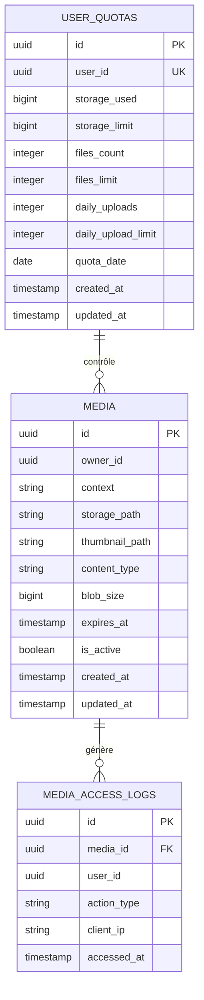
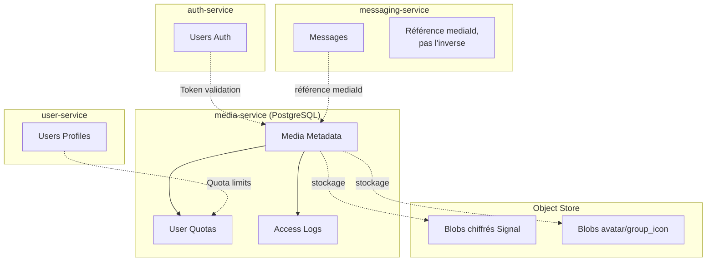

# Media Service (`media-service`) - Conception de la Base de Données

## 0. Sommaire

- [1. Introduction et Principes de Conception](#1-introduction-et-principes-de-conception)
- [2. Schéma PostgreSQL](#2-schéma-postgresql)
  - [2.1 Vue d'Ensemble](#21-vue-densemble)
  - [2.2 Description des Tables](#22-description-des-tables)
- [3. Données Temporaires dans Redis](#3-données-temporaires-dans-redis)
- [4. Relations avec les Autres Services](#4-relations-avec-les-autres-services)
- [5. Considérations de Sécurité](#5-considérations-de-sécurité)
- [6. Considérations de Performance](#6-considérations-de-performance)
- [7. Migrations et Évolution du Schéma](#7-migrations-et-évolution-du-schéma)
- [8. Scripts SQL d'Initialisation](#8-scripts-sql-dinitialisation)

---

## 1. Introduction et Principes de Conception

### 1.1 Objectif
Ce document décrit la structure de la base de données du media-service de l'application Whispr, en cohérence avec le modèle de chiffrement E2E Signal.

### 1.2 Principes Architecturaux

- **Séparation métadonnées/contenu** : métadonnées en PostgreSQL, blobs chiffrés en stockage objet (MinIO/S3)
- **Indépendance du messaging** : la table `media` ne contient pas de références vers les messages ou conversations — c'est le messaging-service qui référence les `mediaId`
- **Namespacing par context** : le champ `context` détermine la politique d'accès et le chemin de stockage
- **Quotas locaux** : la taille des blobs est connue même chiffrée — les quotas sont gérés localement
- **Pas de hash de modération** : le contenu étant chiffré E2E, la modération est déléguée au client mobile ; la déduplication de blobs identiques est gérée en Redis avec TTL

### 1.3 Technologie
- **PostgreSQL** : métadonnées des médias, quotas utilisateur
- **TypeORM** : ORM pour NestJS
- **Redis** : cache des métadonnées, quotas, sessions d'upload, déduplication de blobs
- **MinIO / S3-compatible** : stockage des blobs chiffrés

---

## 2. Schéma PostgreSQL

### 2.1 Vue d'Ensemble


```mermaid
erDiagram
    MEDIA ||--o{ MEDIA_ACCESS_LOGS : "génère"
    USER_QUOTAS ||--o{ MEDIA : "contrôle"

    MEDIA {
        uuid id PK
        uuid owner_id
        string context
        string storage_path
        string thumbnail_path
        string content_type
        bigint blob_size
        timestamp expires_at
        boolean is_active
        timestamp created_at
        timestamp updated_at
    }

    USER_QUOTAS {
        uuid id PK
        uuid user_id UK
        bigint storage_used
        bigint storage_limit
        integer files_count
        integer files_limit
        integer daily_uploads
        integer daily_upload_limit
        date quota_date
        timestamp created_at
        timestamp updated_at
    }

    MEDIA_ACCESS_LOGS {
        uuid id PK
        uuid media_id FK
        uuid user_id
        string action_type
        string client_ip
        timestamp accessed_at
    }
```

### 2.2 Description des Tables

#### 2.2.1 MEDIA
Stocke les métadonnées des blobs chiffrés. Le serveur ne stocke aucune information sur le contenu des fichiers.

| Colonne | Type | Description | Contraintes |
|---|---|---|---|
| id | UUID | Identifiant unique du média | PK, NOT NULL |
| owner_id | UUID | Propriétaire (userId ou groupId selon context) | NOT NULL |
| context | VARCHAR(20) | Type de média : `message`, `avatar`, `group_icon` | NOT NULL |
| storage_path | VARCHAR(500) | Chemin du blob dans le stockage objet | NOT NULL, UNIQUE |
| thumbnail_path | VARCHAR(500) | Chemin du thumbnail (optionnel) | NULL |
| content_type | VARCHAR(100) | Type MIME déclaré (vérifié via magic bytes) | NOT NULL |
| blob_size | BIGINT | Taille du blob chiffré en octets | NOT NULL |
| expires_at | TIMESTAMP | Date d'expiration (non-null pour `message`) | NULL |
| is_active | BOOLEAN | Média actif (false = supprimé logiquement) | NOT NULL, DEFAULT TRUE |
| created_at | TIMESTAMP | Date de création | NOT NULL |
| updated_at | TIMESTAMP | Date de mise à jour | NOT NULL |

**Indices** :
- PRIMARY KEY sur `id`
- INDEX sur `owner_id`
- INDEX sur `context` pour filtrage
- INDEX sur `expires_at` pour le nettoyage automatique des blobs expirés
- INDEX sur `is_active`
- UNIQUE sur `storage_path`

**Note sur les suppressions** : les références croisées (messaging-service référence un `mediaId`) imposent une suppression logique (`is_active = false`) plutôt que physique, afin d'éviter les foreign keys pendantes dans les autres services.

#### 2.2.2 USER_QUOTAS
Gestion des quotas de stockage par utilisateur.

| Colonne | Type | Description | Contraintes |
|---|---|---|---|
| id | UUID | Identifiant unique | PK, NOT NULL |
| user_id | UUID | Identifiant de l'utilisateur | UNIQUE, NOT NULL |
| storage_used | BIGINT | Stockage utilisé en octets | NOT NULL, DEFAULT 0 |
| storage_limit | BIGINT | Limite de stockage en octets | NOT NULL, DEFAULT 1073741824 (1GB) |
| files_count | INTEGER | Nombre de fichiers actifs | NOT NULL, DEFAULT 0 |
| files_limit | INTEGER | Limite de fichiers | NOT NULL, DEFAULT 1000 |
| daily_uploads | INTEGER | Uploads du jour courant | NOT NULL, DEFAULT 0 |
| daily_upload_limit | INTEGER | Limite uploads/jour | NOT NULL, DEFAULT 100 |
| quota_date | DATE | Date de référence du quota quotidien | NOT NULL |
| created_at | TIMESTAMP | Date de création | NOT NULL |
| updated_at | TIMESTAMP | Date de mise à jour | NOT NULL |

**Indices** :
- PRIMARY KEY sur `id`
- UNIQUE sur `user_id`
- INDEX sur `quota_date` pour la réinitialisation quotidienne

#### 2.2.3 MEDIA_ACCESS_LOGS
Journalisation des accès pour audit et sécurité. Table partitionnée par mois.

| Colonne | Type | Description | Contraintes |
|---|---|---|---|
| id | UUID | Identifiant unique du log | NOT NULL |
| media_id | UUID | Référence au média | NOT NULL |
| user_id | UUID | Utilisateur ayant effectué l'action | NOT NULL |
| action_type | VARCHAR(50) | `upload`, `download`, `delete` | NOT NULL |
| client_ip | INET | Adresse IP du client | NOT NULL |
| accessed_at | TIMESTAMP | Date/heure de l'action | NOT NULL |
| PRIMARY KEY | | `(accessed_at, id)` — requis pour partitionnement | |

**Partitionnement** : `PARTITION BY RANGE (accessed_at)` mensuel.

---

## 3. Données Temporaires dans Redis

### 3.1 UPLOAD_SESSIONS
Sessions d'upload multipart en cours.

**Clé** : `upload:session:{sessionId}`
**Type** : Hash
**TTL** : 24h
**Champs** : `user_id`, `context`, `owner_id`, `total_size`, `uploaded_chunks`

### 3.2 USER_QUOTA_CACHE
Cache des quotas pour validation rapide sans requête PostgreSQL à chaque upload.

**Clé** : `quota:user:{userId}`
**Type** : Hash
**TTL** : 1h
**Champs** : `storage_used`, `storage_limit`, `daily_uploads`, `last_updated`

### 3.3 MEDIA_METADATA_CACHE
Cache des métadonnées fréquemment accédées.

**Clé** : `media:meta:{mediaId}`
**Type** : Hash
**TTL** : 30min
**Champs** : `content_type`, `blob_size`, `owner_id`, `context`, `expires_at`

### 3.4 BLOB_DEDUP_CACHE
Déduplication des blobs identiques (même hash SHA-256 du blob chiffré). Évite le re-stockage d'un fichier identique re-uploadé à l'identique.

**Clé** : `dedup:blob:{sha256_of_blob}`
**Type** : String (mediaId existant)
**TTL** : 7j

> Ce cache ne permet pas la détection de contenu similaire (impossible sur des blobs chiffrés) — uniquement la déduplication exacte de blobs identiques.

---

## 4. Relations avec les Autres Services


```mermaid
graph TB
    subgraph "media-service (PostgreSQL)"
        A[Media Metadata] --> B[User Quotas]
        A --> C[Access Logs]
    end

    subgraph "auth-service"
        D[Users Auth]
    end

    subgraph "user-service"
        E[Users Profiles]
    end

    subgraph "messaging-service"
        F[Messages]
        note1["Référence mediaId,\npas l'inverse"]
    end

    subgraph "Object Store"
        G[Blobs chiffrés Signal]
        H[Blobs avatar/group_icon]
    end

    D -.->|Token validation| A
    E -.->|Quota limits| B
    F -.->|référence mediaId| A
    A -.->|stockage| G
    A -.->|stockage| H
```

**Démarcation claire** :
- Le media-service ne connaît pas les messages ni les conversations
- C'est le messaging-service qui stocke `{ messageId, mediaId }` — pas le media-service qui stocke `{ mediaId, messageId }`
- En cas de suppression d'un message, le messaging-service notifie le media-service pour désactiver le média (`is_active = false`)

---

## 5. Considérations de Sécurité

### 5.1 Ce que la Base de Données Contient
La base PostgreSQL contient uniquement des **métadonnées non sensibles** :
- Taille des blobs, type MIME déclaré, chemins de stockage
- Aucune clé de chiffrement (les clés Signal transitent dans le canal Signal, jamais via le media-service)
- Aucune donnée EXIF (incluse dans les blobs chiffrés, inaccessible)

### 5.2 Protection des Métadonnées
- **Chiffrement au repos** : base PostgreSQL chiffrée (TDE)
- **Row Level Security** : isolation des données par `owner_id`
- **Accès contrôlé** : le service applicatif est le seul à accéder à la DB (pas d'accès direct externe)

### 5.3 Audit
- Tous les accès (upload, download, delete) loggés dans `MEDIA_ACCESS_LOGS`
- Rétention 90 jours pour investigations
- Partitionnement mensuel pour performance et archivage

---

## 6. Considérations de Performance

### 6.1 Indexation
- Index composites `(owner_id, created_at)` pour lister les médias d'un utilisateur triés
- Index partiel `WHERE is_active = true` pour les requêtes courantes
- Index sur `expires_at` pour le job de nettoyage des blobs expirés
- Pas d'index GIN sur JSONB (pas de colonnes JSONB dans le nouveau schéma — les métadonnées sont structurées)

### 6.2 Partitionnement
```sql
CREATE TABLE media_access_logs (
    id UUID NOT NULL,
    accessed_at TIMESTAMP NOT NULL,
    PRIMARY KEY (accessed_at, id)
) PARTITION BY RANGE (accessed_at);
```

### 6.3 Optimisations Redis
- TTL optimisés par usage : quota (1h), metadata (30min), dedup (7j)
- Pipeline Redis pour les opérations en lot (quota check + update)
- Éviction LRU pour le cache metadata

---

## 7. Migrations et Évolution du Schéma

- **Migrations TypeORM** : progressives, backward-compatible (`typeorm migration:generate`, `migration:run`)
- **Zero Downtime** : ajout de colonnes nullable avant suppression des anciennes
- **Rollback** : chaque migration TypeORM dispose d'une méthode `down()`

```typescript
// src/modules/media/entities/media.entity.ts
import {
  Entity, PrimaryGeneratedColumn, Column,
  CreateDateColumn, UpdateDateColumn, Index, OneToMany,
} from 'typeorm';
import { MediaAccessLog } from './media-access-log.entity';

@Entity('media')
@Index(['ownerId'])
@Index(['context'])
@Index(['expiresAt'])
export class Media {
  @PrimaryGeneratedColumn('uuid')
  id: string;

  @Column({ name: 'owner_id', type: 'uuid' })
  ownerId: string;

  @Column({ type: 'varchar', length: 20 })
  context: 'message' | 'avatar' | 'group_icon';

  @Column({ name: 'storage_path', type: 'varchar', length: 500, unique: true })
  storagePath: string;

  @Column({ name: 'thumbnail_path', type: 'varchar', length: 500, nullable: true })
  thumbnailPath: string | null;

  @Column({ name: 'content_type', type: 'varchar', length: 100 })
  contentType: string;

  @Column({ name: 'blob_size', type: 'bigint' })
  blobSize: number;

  @Column({ name: 'expires_at', type: 'timestamp', nullable: true })
  expiresAt: Date | null;

  @Column({ name: 'is_active', type: 'boolean', default: true })
  isActive: boolean;

  @CreateDateColumn({ name: 'created_at' })
  createdAt: Date;

  @UpdateDateColumn({ name: 'updated_at' })
  updatedAt: Date;

  @OneToMany(() => MediaAccessLog, (log) => log.media)
  accessLogs: MediaAccessLog[];
}
```

```typescript
// src/modules/media/entities/user-quota.entity.ts
import {
  Entity, PrimaryGeneratedColumn, Column,
  CreateDateColumn, UpdateDateColumn,
} from 'typeorm';

@Entity('user_quotas')
export class UserQuota {
  @PrimaryGeneratedColumn('uuid')
  id: string;

  @Column({ name: 'user_id', type: 'uuid', unique: true })
  userId: string;

  @Column({ name: 'storage_used', type: 'bigint', default: 0 })
  storageUsed: number;

  @Column({ name: 'storage_limit', type: 'bigint', default: 1073741824 })
  storageLimit: number;

  @Column({ name: 'files_count', type: 'int', default: 0 })
  filesCount: number;

  @Column({ name: 'files_limit', type: 'int', default: 1000 })
  filesLimit: number;

  @Column({ name: 'daily_uploads', type: 'int', default: 0 })
  dailyUploads: number;

  @Column({ name: 'daily_upload_limit', type: 'int', default: 100 })
  dailyUploadLimit: number;

  @Column({ name: 'quota_date', type: 'date' })
  quotaDate: string;

  @CreateDateColumn({ name: 'created_at' })
  createdAt: Date;

  @UpdateDateColumn({ name: 'updated_at' })
  updatedAt: Date;
}
```

---

## 8. Scripts SQL d'Initialisation

```sql
CREATE EXTENSION IF NOT EXISTS "uuid-ossp";

-- Table principale des médias
CREATE TABLE media (
    id            UUID PRIMARY KEY DEFAULT uuid_generate_v4(),
    owner_id      UUID NOT NULL,
    context       VARCHAR(20) NOT NULL CHECK (context IN ('message', 'avatar', 'group_icon')),
    storage_path  VARCHAR(500) NOT NULL UNIQUE,
    thumbnail_path VARCHAR(500),
    content_type  VARCHAR(100) NOT NULL,
    blob_size     BIGINT NOT NULL,
    expires_at    TIMESTAMP,
    is_active     BOOLEAN NOT NULL DEFAULT TRUE,
    created_at    TIMESTAMP NOT NULL DEFAULT NOW(),
    updated_at    TIMESTAMP NOT NULL DEFAULT NOW()
);

CREATE INDEX idx_media_owner_id ON media(owner_id);
CREATE INDEX idx_media_context ON media(context);
CREATE INDEX idx_media_expires_at ON media(expires_at) WHERE expires_at IS NOT NULL;
CREATE INDEX idx_media_active ON media(is_active) WHERE is_active = true;
CREATE INDEX idx_media_owner_created ON media(owner_id, created_at DESC);

-- Table des quotas utilisateur
CREATE TABLE user_quotas (
    id                UUID PRIMARY KEY DEFAULT uuid_generate_v4(),
    user_id           UUID NOT NULL UNIQUE,
    storage_used      BIGINT NOT NULL DEFAULT 0,
    storage_limit     BIGINT NOT NULL DEFAULT 1073741824,
    files_count       INTEGER NOT NULL DEFAULT 0,
    files_limit       INTEGER NOT NULL DEFAULT 1000,
    daily_uploads     INTEGER NOT NULL DEFAULT 0,
    daily_upload_limit INTEGER NOT NULL DEFAULT 100,
    quota_date        DATE NOT NULL DEFAULT CURRENT_DATE,
    created_at        TIMESTAMP NOT NULL DEFAULT NOW(),
    updated_at        TIMESTAMP NOT NULL DEFAULT NOW()
);

CREATE INDEX idx_user_quotas_quota_date ON user_quotas(quota_date);

-- Table des logs d'accès (partitionnée par mois)
CREATE TABLE media_access_logs (
    id           UUID NOT NULL,
    media_id     UUID NOT NULL,
    user_id      UUID NOT NULL,
    action_type  VARCHAR(50) NOT NULL,
    client_ip    INET NOT NULL,
    accessed_at  TIMESTAMP NOT NULL DEFAULT NOW(),
    PRIMARY KEY (accessed_at, id)
) PARTITION BY RANGE (accessed_at);

-- Partitions initiales
CREATE TABLE media_access_logs_2026_03 PARTITION OF media_access_logs
    FOR VALUES FROM ('2026-03-01') TO ('2026-04-01');
CREATE TABLE media_access_logs_2026_04 PARTITION OF media_access_logs
    FOR VALUES FROM ('2026-04-01') TO ('2026-05-01');

-- Trigger updated_at
CREATE OR REPLACE FUNCTION update_timestamp()
RETURNS TRIGGER AS $$
BEGIN
   NEW.updated_at = NOW();
   RETURN NEW;
END;
$$ LANGUAGE plpgsql;

CREATE TRIGGER update_media_timestamp
BEFORE UPDATE ON media
FOR EACH ROW EXECUTE PROCEDURE update_timestamp();

CREATE TRIGGER update_user_quotas_timestamp
BEFORE UPDATE ON user_quotas
FOR EACH ROW EXECUTE PROCEDURE update_timestamp();

-- Row Level Security
ALTER TABLE media ENABLE ROW LEVEL SECURITY;
ALTER TABLE user_quotas ENABLE ROW LEVEL SECURITY;

CREATE POLICY media_owner_policy ON media
    FOR ALL TO authenticated_users
    USING (owner_id = current_setting('app.current_user_id')::UUID);

CREATE POLICY quota_owner_policy ON user_quotas
    FOR ALL TO authenticated_users
    USING (user_id = current_setting('app.current_user_id')::UUID);
```
